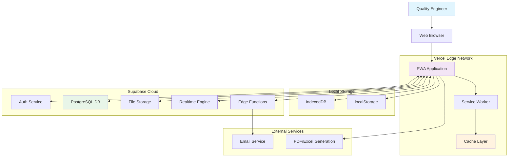
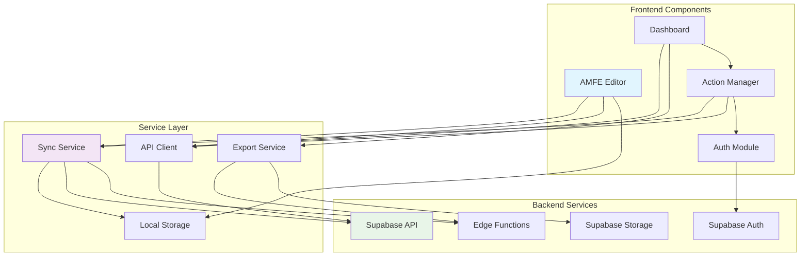
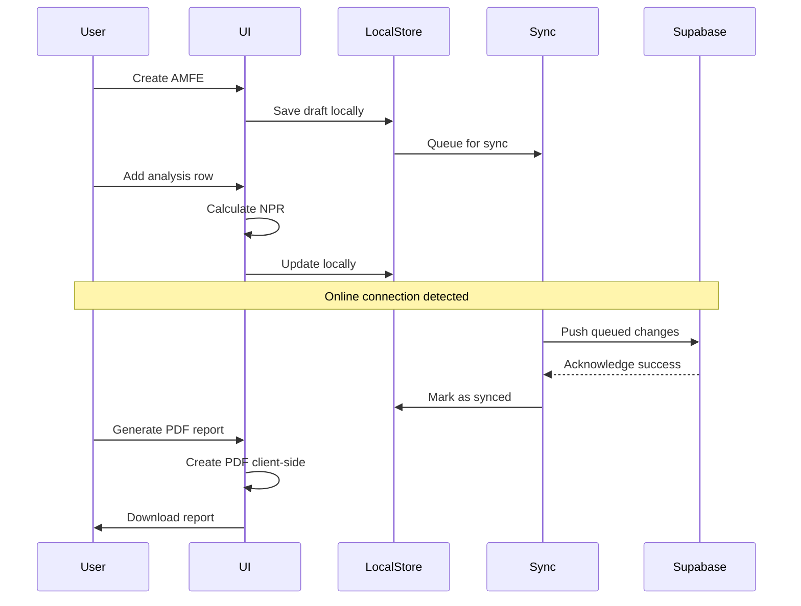
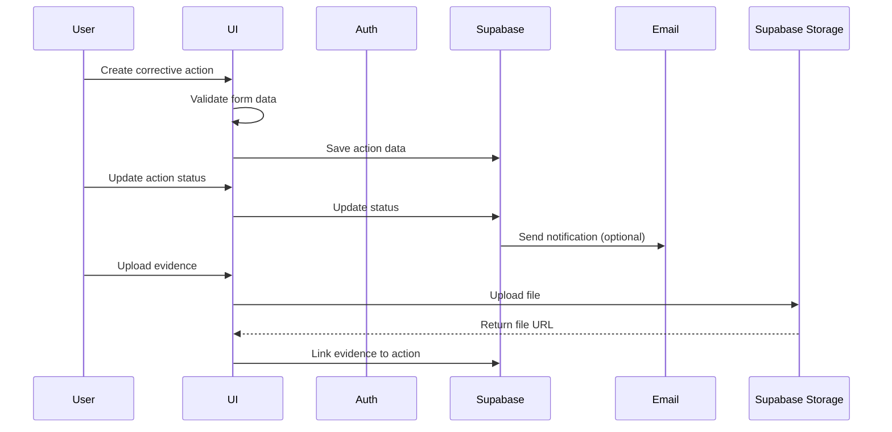
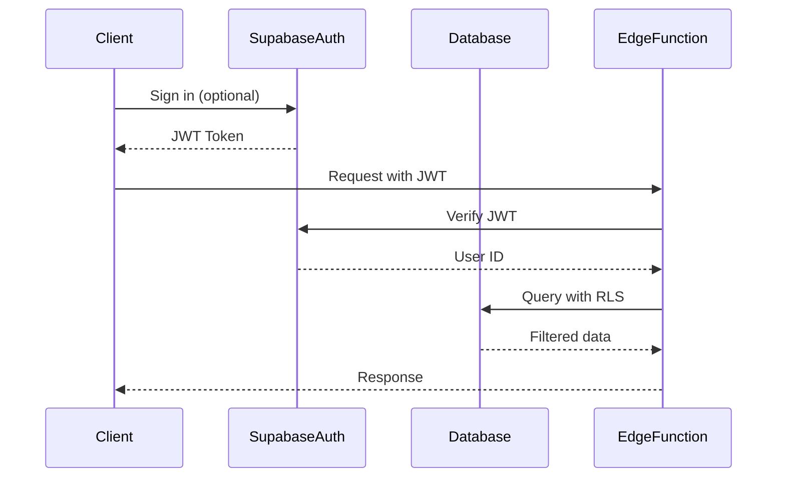

# Herramienta AMFE para Mejora Continua - Fullstack Architecture Document

## Introduction

This document outlines the complete fullstack architecture for **Herramienta AMFE para Mejora Continua**, including backend systems, frontend implementation, and their integration. It serves as the single source of truth for AI-driven development, ensuring consistency across the entire technology stack.

This unified approach combines what would traditionally be separate backend and frontend architecture documents, streamlining the development process for modern fullstack applications where these concerns are increasingly intertwined.

### Starter Template or Existing Project

Based on the PRD review, this is a **greenfield project** with specific technology choices already defined:

- **Platform Choice:** Supabase + Vercel fullstack architecture
- **Frontend:** React 18 + TypeScript with Tailwind CSS
- **Backend:** Supabase (PostgreSQL + Edge Functions)
- **Deployment:** Vercel for frontend, Supabase for backend/database
- **Repository Structure:** Monorepo with `/frontend`, `/docs`, and `/functions`

### Change Log

| Date | Version | Description | Author |
|------|---------|-------------|--------|
| 2025-10-31 | 1.0 | Initial architecture creation | Winston (Architect) |

## High Level Architecture

### Technical Summary

The AMFE tool implements a serverless-first Jamstack architecture leveraging Supabase for backend-as-a-service and Vercel for edge deployment. The React frontend utilizes TypeScript for type safety across the fullstack, with Tailwind CSS providing responsive design and Headless UI ensuring accessibility. Local storage combined with Supabase sync enables offline capability while maintaining cloud persistence, all optimized to maintain sub-3-second load times and a bundle size under 5MB.

### Platform and Infrastructure Choice

**Selected Platform:** **Supabase + Vercel**

**Key Services:**
- **Frontend Hosting:** Vercel Edge Network
- **Database:** Supabase PostgreSQL (Free Tier)
- **Authentication:** Supabase Auth (optional)
- **File Storage:** Supabase Storage
- **Edge Functions:** Supabase Edge Functions
- **Real-time Sync:** Supabase Realtime

**Deployment Host and Regions:**
- **Frontend:** Vercel's global edge network (automatic region selection)
- **Backend:** Supabase AWS (us-east-1 region)

**Rationale for Choice:**
1. **Cost Optimization:** Free tier supports 100 users, aligning with MVP goals
2. **Development Speed:** Backend-as-a-service eliminates infrastructure setup
3. **Scalability:** Serverless architecture scales automatically with usage
4. **Performance:** Global CDN ensures fast loading across manufacturing sites
5. **Offline Support:** Local storage + sync strategy works well with Supabase APIs

### Repository Structure

**Structure:** Monorepo
**Monorepo Tool:** npm workspaces (simplest approach)
**Package Organization:**
- `/frontend` - React application
- `/functions` - Supabase Edge Functions (if needed)
- `/docs` - Documentation and architecture
- `/shared` - Shared types and utilities (future)

### Architecture Diagram



### Architectural Patterns

- **Progressive Web App (PWA):** Native-like experience with offline capabilities - _Rationale:_ Essential for manufacturing floor environments with unreliable connectivity
- **Offline-First Architecture:** Local storage as primary source, sync to cloud - _Rationale:_ Ensures continuous operation in plant environments
- **Repository Pattern:** Abstract data access through service layer - _Rationale:_ Enables testing and future database migration flexibility
- **Component-Based UI:** Reusable React components with TypeScript - _Rationale:_ Maintainability and type safety across engineering data
- **State Management with Zustand:** Simple, predictable state handling - _Rationale:_ Minimal boilerplate while maintaining predictability
- **Serverless Backend:** Edge functions for compute needs - _Rationale:_ Cost-effective scaling for sporadic usage patterns
- **Real-time Synchronization:** Automatic multi-device sync - _Rationale:_ Seamless experience between desktop and mobile devices

## Tech Stack

This is the DEFINITIVE technology selection for the entire project. All development must use these exact versions.

### Technology Stack Table

| Category | Technology | Version | Purpose | Rationale |
|----------|------------|---------|---------|-----------|
| Frontend Language | TypeScript | 5.0+ | Type safety & developer productivity | Catches errors early, better IDE support, shared types with backend |
| Frontend Framework | React | 18.2+ | UI framework with hooks & concurrent features | Mature ecosystem, server-side rendering ready, large talent pool |
| UI Component Library | Headless UI | 1.7+ | Unstyled accessible components | Full accessibility support, complete control over styling |
| State Management | Zustand | 4.4+ | Lightweight state management | Minimal boilerplate, TypeScript friendly, simple learning curve |
| Backend Language | TypeScript | 5.0+ | Consistent typing across stack | Shared types between frontend and edge functions |
| Backend Framework | Supabase | Latest | BaaS platform with PostgreSQL | Free tier generous limits, built-in auth/storage/realtime |
| API Style | REST | OpenAPI 3.0 | Standard RESTful APIs | Simple, widely understood, good tooling support |
| Database | PostgreSQL | 15+ | Primary data store via Supabase | Powerful relational features, good JSON support, reliable |
| Cache | IndexedDB | Browser API | Local offline storage | Native browser support, large storage capacity |
| File Storage | Supabase Storage | Latest | Evidence files & exports | Integrated with auth, automatic CDN, generous free tier |
| Authentication | Supabase Auth | Latest | Optional user authentication | Email/password, social logins, row-level security |
| Frontend Testing | Jest + RTL | 29+ | Unit & integration testing | React ecosystem standard, good mocking support |
| Backend Testing | Supabase CLI | Latest | Database testing | Native Supabase testing tools |
| E2E Testing | Playwright | 1.40+ | End-to-end testing | Cross-browser, reliable, good debugging |
| Build Tool | Vite | 5.0+ | Fast build tool | Lightning fast HMR, optimized bundles |
| Bundler | Vite | 5.0+ | Application bundling | Built-in bundling with optimization |
| IaC Tool | Supabase CLI | Latest | Database migrations | Native Supabase support, local development |
| CI/CD | GitHub Actions | Latest | Automated deployment | Free for public repos, excellent GitHub integration |
| Monitoring | Vercel Analytics | Latest | Frontend metrics | Built-in to Vercel, privacy-compliant |
| Logging | Supabase Logs | Latest | Backend logs | Integrated with Supabase dashboard |
| CSS Framework | Tailwind CSS | 3.3+ | Utility-first CSS | Rapid development, consistent design, small bundle |

## Data Models

Based on the PRD requirements, I've identified the core entities that will structure our AMFE system. These models are designed to support the complete workflow from AMFE creation through corrective action tracking, with offline-first capabilities.

### AMFE

**Purpose:** Represents a complete Failure Mode Effects Analysis document containing all analysis data, metadata, and relationships to actions.

**Key Attributes:**
- id: string - Unique identifier (UUID)
- name: string - AMFE title/name for identification
- type: enum - DFMEA or PFMEA analysis type
- description: string - Scope and purpose description
- status: enum - Draft, In Progress, Completed, Archived
- created_at: timestamp - Document creation timestamp
- updated_at: timestamp - Last modification timestamp
- created_by: string - Owner user ID (nullable for anonymous)

**TypeScript Interface:**
```typescript
interface AMFE {
  id: string;
  name: string;
  type: 'DFMEA' | 'PFMEA';
  description: string;
  scope?: string;
  status: 'draft' | 'in_progress' | 'completed' | 'archived';
  created_at: string;
  updated_at: string;
  created_by?: string;
  npr_threshold?: number; // Custom threshold for high NPR
  metadata: {
    version: number;
    template_id?: string;
    tags: string[];
  };
}
```

**Relationships:**
- One-to-many with AMFEItem (analysis rows)
- One-to-many with CorrectiveAction
- Belongs to User (optional)

### AMFEItem

**Purpose:** Individual row in the AMFE matrix representing a specific failure mode analysis with all AIAG-VDA standard fields.

**Key Attributes:**
- id: string - Unique row identifier
- amfe_id: string - Parent AMFE document ID
- function: string - Process or product function analyzed
- failure_mode: string - How the failure occurs
- failure_effect: string - Consequences of failure
- failure_cause: string - Root cause of failure
- current_controls: string - Existing prevention/detection controls
- severity: number - Severity rating (1-10)
- occurrence: number - Occurrence rating (1-10)
- detection: number - Detection rating (1-10)
- npr: number - Calculated risk priority number
- risk_level: enum - Low, Medium, High, Critical

**TypeScript Interface:**
```typescript
interface AMFEItem {
  id: string;
  amfe_id: string;
  row_number: number;
  function: string;
  failure_mode: string;
  failure_effect: string;
  failure_cause: string;
  current_controls: string;
  severity: number; // 1-10
  occurrence: number; // 1-10
  detection: number; // 1-10
  npr: number; // Calculated: severity * occurrence * detection
  risk_level: 'low' | 'medium' | 'high' | 'critical';
  notes?: string;
  created_at: string;
  updated_at: string;
}
```

**Relationships:**
- Belongs to AMFE
- One-to-many with CorrectiveAction

### CorrectiveAction

**Purpose:** Tracks corrective actions for high NPR items including cost tracking, responsibility assignment, and status management.

**Key Attributes:**
- id: string - Unique action identifier
- amfe_item_id: string - Associated AMFE row
- description: string - Action description
- responsible: string - Person/team responsible
- contact: string - Email or phone for responsible
- due_date: date - Target completion date
- cost_estimated: number - Estimated implementation cost
- cost_actual: number - Actual implementation cost
- status: enum - Pending, In Progress, Completed, Verified
- completion_date: date - Actual completion date

**TypeScript Interface:**
```typescript
interface CorrectiveAction {
  id: string;
  amfe_item_id: string;
  description: string;
  responsible: string;
  contact: string;
  due_date: string;
  cost_estimated: number;
  cost_actual?: number;
  status: 'pending' | 'in_progress' | 'completed' | 'verified';
  completion_date?: string;
  roi?: number; // Calculated ROI
  notes?: string;
  created_at: string;
  updated_at: string;
}
```

**Relationships:**
- Belongs to AMFEItem
- One-to-many with Evidence

### FailureMode

**Purpose:** Pre-loaded library of common failure modes organized by manufacturing categories to accelerate analysis.

**Key Attributes:**
- id: string - Unique identifier
- category: string - Manufacturing category
- mode: string - Failure mode description
- common_causes: array - List of typical causes
- severity_default: number - Suggested severity rating
- tags: array - Search tags

**TypeScript Interface:**
```typescript
interface FailureMode {
  id: string;
  category: string;
  mode: string;
  common_causes: string[];
  severity_default?: number;
  tags: string[];
  industry_type?: string;
}
```

**Relationships:**
- Many-to-many with AMFEItem (via selections)

### Evidence

**Purpose:** File attachments proving corrective action implementation and effectiveness.

**Key Attributes:**
- id: string - Unique evidence identifier
- action_id: string - Parent corrective action
- file_name: string - Original file name
- file_path: string - Storage path
- file_type: string - MIME type
- file_size: number - File size in bytes
- uploaded_by: string - Uploader information
- description: string - Evidence description

**TypeScript Interface:**
```typescript
interface Evidence {
  id: string;
  action_id: string;
  file_name: string;
  file_path: string;
  file_type: string;
  file_size: number;
  uploaded_by?: string;
  description?: string;
  created_at: string;
}
```

**Relationships:**
- Belongs to CorrectiveAction

### User

**Purpose:** Optional user accounts for cloud synchronization and multi-device access.

**Key Attributes:**
- id: string - User UUID
- email: string - User email (optional auth)
- name: string - Display name
- preferences: object - User preferences
- created_at: string - Account creation
- last_login: string - Last activity

**TypeScript Interface:**
```typescript
interface User {
  id: string;
  email?: string;
  name: string;
  preferences: {
    theme: 'light' | 'dark';
    language: string;
    default_npr_threshold: number;
    auto_sync: boolean;
  };
  created_at: string;
  last_login?: string;
}
```

**Relationships:**
- One-to-many with AMFE (as owner)

---

**Data Model Design Decisions:**

1. **Nullable User IDs:** Supporting both anonymous (local-only) and authenticated usage
2. **Calculated Fields:** NPR and risk_level calculated but stored for performance
3. **Status Enums:** Standardized workflow states across all entities
4. **Timestamp Tracking:** Full audit trail with created/updated timestamps
5. **JSON Metadata:** Flexible fields for future expansion without schema changes

---

## API Specification

Based on our REST API choice, here's the OpenAPI 3.0 specification for all required endpoints:

```yaml
openapi: 3.0.0
info:
  title: AMFE Tool API
  version: 1.0.0
  description: REST API for AMFE Failure Analysis Tool
servers:
  - url: https://api.amfe-tool.com
    description: Production server
  - url: http://localhost:3000
    description: Development server

paths:
  # AMFE Management
  /amfes:
    get:
      summary: List all AMFEs
      tags: [AMFEs]
      parameters:
        - name: type
          in: query
          schema:
            type: string
            enum: [DFMEA, PFMEA]
        - name: status
          in: query
          schema:
            type: string
            enum: [draft, in_progress, completed, archived]
        - name: search
          in: query
          schema:
            type: string
      responses:
        '200':
          description: List of AMFEs
          content:
            application/json:
              schema:
                type: array
                items:
                  $ref: '#/components/schemas/AMFE'

    post:
      summary: Create new AMFE
      tags: [AMFEs]
      requestBody:
        required: true
        content:
          application/json:
            schema:
              $ref: '#/components/schemas/AMFECreate'
      responses:
        '201':
          description: AMFE created
          content:
            application/json:
              schema:
                $ref: '#/components/schemas/AMFE'

  /amfes/{id}:
    get:
      summary: Get AMFE by ID
      tags: [AMFEs]
      parameters:
        - name: id
          in: path
          required: true
          schema:
            type: string
      responses:
        '200':
          description: AMFE details
          content:
            application/json:
              schema:
                $ref: '#/components/schemas/AMFEWithItems'

    put:
      summary: Update AMFE
      tags: [AMFEs]
      parameters:
        - name: id
          in: path
          required: true
          schema:
            type: string
      requestBody:
        required: true
        content:
          application/json:
            schema:
              $ref: '#/components/schemas/AMFEUpdate'
      responses:
        '200':
          description: AMFE updated

    delete:
      summary: Delete AMFE
      tags: [AMFEs]
      parameters:
        - name: id
          in: path
          required: true
          schema:
            type: string
      responses:
        '204':
          description: AMFE deleted

  # AMFE Items
  /amfes/{id}/items:
    get:
      summary: Get AMFE items
      tags: [AMFE Items]
      parameters:
        - name: id
          in: path
          required: true
          schema:
            type: string
      responses:
        '200':
          description: List of AMFE items
          content:
            application/json:
              schema:
                type: array
                items:
                  $ref: '#/components/schemas/AMFEItem'

    post:
      summary: Add AMFE item
      tags: [AMFE Items]
      parameters:
        - name: id
          in: path
          required: true
          schema:
            type: string
      requestBody:
        required: true
        content:
          application/json:
            schema:
              $ref: '#/components/schemas/AMFEItemCreate'
      responses:
        '201':
          description: Item created

  /amfes/{id}/items/batch:
    put:
      summary: Batch update AMFE items
      tags: [AMFE Items]
      parameters:
        - name: id
          in: path
          required: true
          schema:
            type: string
      requestBody:
        required: true
        content:
          application/json:
            schema:
              type: array
              items:
                $ref: '#/components/schemas/AMFEItem'
      responses:
        '200':
          description: Items updated

  # Corrective Actions
  /actions:
    get:
      summary: List corrective actions
      tags: [Actions]
      parameters:
        - name: status
          in: query
          schema:
            type: string
            enum: [pending, in_progress, completed, verified]
        - name: responsible
          in: query
          schema:
            type: string
        - name: due_before
          in: query
          schema:
            type: string
            format: date
      responses:
        '200':
          description: List of actions
          content:
            application/json:
              schema:
                type: array
                items:
                  $ref: '#/components/schemas/CorrectiveAction'

    post:
      summary: Create corrective action
      tags: [Actions]
      requestBody:
        required: true
        content:
          application/json:
            schema:
              $ref: '#/components/schemas/CorrectiveActionCreate'
      responses:
        '201':
          description: Action created

  /actions/{id}:
    put:
      summary: Update corrective action
      tags: [Actions]
      parameters:
        - name: id
          in: path
          required: true
          schema:
            type: string
      requestBody:
        required: true
        content:
          application/json:
            schema:
              $ref: '#/components/schemas/CorrectiveActionUpdate'
      responses:
        '200':
          description: Action updated

  # Failure Modes Library
  /failure-modes:
    get:
      summary: Get failure modes library
      tags: [Library]
      parameters:
        - name: category
          in: query
          schema:
            type: string
        - name: search
          in: query
          schema:
            type: string
      responses:
        '200':
          description: Failure modes list
          content:
            application/json:
              schema:
                type: array
                items:
                  $ref: '#/components/schemas/FailureMode'

  # Evidence Upload
  /actions/{id}/evidence:
    post:
      summary: Upload evidence file
      tags: [Evidence]
      parameters:
        - name: id
          in: path
          required: true
          schema:
            type: string
      requestBody:
        required: true
        content:
          multipart/form-data:
            schema:
              type: object
              properties:
                file:
                  type: string
                  format: binary
                description:
                  type: string
      responses:
        '201':
          description: Evidence uploaded
          content:
            application/json:
              schema:
                $ref: '#/components/schemas/Evidence'

  # Reports Export
  /amfes/{id}/export/pdf:
    get:
      summary: Export AMFE as PDF
      tags: [Reports]
      parameters:
        - name: id
          in: path
          required: true
          schema:
            type: string
        - name: include_actions
          in: query
          schema:
            type: boolean
      responses:
        '200':
          description: PDF file
          content:
            application/pdf:
              schema:
                type: string
                format: binary

  /amfes/{id}/export/excel:
    get:
      summary: Export AMFE as Excel
      tags: [Reports]
      parameters:
        - name: id
          in: path
          required: true
          schema:
            type: string
      responses:
        '200':
          description: Excel file
          content:
            application/vnd.openxmlformats-officedocument.spreadsheetml.sheet:
              schema:
                type: string
                format: binary

components:
  schemas:
    AMFE:
      type: object
      properties:
        id:
          type: string
        name:
          type: string
        type:
          type: string
          enum: [DFMEA, PFMEA]
        description:
          type: string
        status:
          type: string
          enum: [draft, in_progress, completed, archived]
        created_at:
          type: string
          format: date-time
        updated_at:
          type: string
          format: date-time
        created_by:
          type: string
        npr_threshold:
          type: number
        metadata:
          type: object
          properties:
            version:
              type: number
            tags:
              type: array
              items:
                type: string

    AMFECreate:
      type: object
      required: [name, type]
      properties:
        name:
          type: string
        type:
          type: string
          enum: [DFMEA, PFMEA]
        description:
          type: string
        scope:
          type: string
        npr_threshold:
          type: number
          default: 100

    AMFEUpdate:
      type: object
      properties:
        name:
          type: string
        description:
          type: string
        status:
          type: string
          enum: [draft, in_progress, completed, archived]
        npr_threshold:
          type: number

    AMFEWithItems:
      allOf:
        - $ref: '#/components/schemas/AMFE'
        - type: object
          properties:
            items:
              type: array
              items:
                $ref: '#/components/schemas/AMFEItem'
            actions:
              type: array
              items:
                $ref: '#/components/schemas/CorrectiveAction'

    AMFEItem:
      type: object
      properties:
        id:
          type: string
        amfe_id:
          type: string
        row_number:
          type: number
        function:
          type: string
        failure_mode:
          type: string
        failure_effect:
          type: string
        failure_cause:
          type: string
        current_controls:
          type: string
        severity:
          type: number
          minimum: 1
          maximum: 10
        occurrence:
          type: number
          minimum: 1
          maximum: 10
        detection:
          type: number
          minimum: 1
          maximum: 10
        npr:
          type: number
        risk_level:
          type: string
          enum: [low, medium, high, critical]
        notes:
          type: string
        created_at:
          type: string
          format: date-time
        updated_at:
          type: string
          format: date-time

    AMFEItemCreate:
      type: object
      required: [function, failure_mode, failure_effect, failure_cause, current_controls, severity, occurrence, detection]
      properties:
        function:
          type: string
        failure_mode:
          type: string
        failure_effect:
          type: string
        failure_cause:
          type: string
        current_controls:
          type: string
        severity:
          type: number
          minimum: 1
          maximum: 10
        occurrence:
          type: number
          minimum: 1
          maximum: 10
        detection:
          type: number
          minimum: 1
          maximum: 10
        notes:
          type: string

    CorrectiveAction:
      type: object
      properties:
        id:
          type: string
        amfe_item_id:
          type: string
        description:
          type: string
        responsible:
          type: string
        contact:
          type: string
        due_date:
          type: string
          format: date
        cost_estimated:
          type: number
        cost_actual:
          type: number
        status:
          type: string
          enum: [pending, in_progress, completed, verified]
        completion_date:
          type: string
          format: date
        roi:
          type: number
        notes:
          type: string
        created_at:
          type: string
          format: date-time
        updated_at:
          type: string
          format: date-time

    CorrectiveActionCreate:
      type: object
      required: [amfe_item_id, description, responsible, due_date]
      properties:
        amfe_item_id:
          type: string
        description:
          type: string
        responsible:
          type: string
        contact:
          type: string
        due_date:
          type: string
          format: date
        cost_estimated:
          type: number

    CorrectiveActionUpdate:
      type: object
      properties:
        description:
          type: string
        status:
          type: string
          enum: [pending, in_progress, completed, verified]
        completion_date:
          type: string
          format: date
        cost_actual:
          type: number

    FailureMode:
      type: object
      properties:
        id:
          type: string
        category:
          type: string
        mode:
          type: string
        common_causes:
          type: array
          items:
            type: string
        severity_default:
          type: number
        tags:
          type: array
          items:
            type: string
        industry_type:
          type: string

    Evidence:
      type: object
      properties:
        id:
          type: string
        action_id:
          type: string
        file_name:
          type: string
        file_path:
          type: string
        file_type:
          type: string
        file_size:
          type: number
        description:
          type: string
        created_at:
          type: string
          format: date-time

  securitySchemes:
    BearerAuth:
      type: http
      scheme: bearer
      bearerFormat: JWT

security:
  - BearerAuth: []
  - {}
```

---

## Components

Based on the architectural patterns and tech stack, here are the major logical components across the fullstack:

### AMFE Editor Component

**Responsibility:** Core spreadsheet-like interface for editing AMFE matrices with real-time NPR calculations and Excel-like navigation.

**Key Interfaces:**
- `updateCell(rowId, field, value)` - Update individual cell values
- `addRow(position)` - Insert new row at specific position
- `deleteRow(rowId)` - Remove row with confirmation
- `calculateNPR(severity, occurrence, detection)` - Auto-calculate risk priority
- `validateInput(field, value)` - Input validation for ratings

**Dependencies:** AMFE data store, Failure Mode library, State management
**Technology Stack:** React + TypeScript, Zustand for state, Tailwind CSS for styling

### Action Management Component

**Responsibility:** Manages corrective actions lifecycle including creation, status tracking, cost updates, and evidence attachment.

**Key Interfaces:**
- `createAction(amfeItemId, actionData)` - Create new corrective action
- `updateStatus(actionId, status)` - Update action status with workflow validation
- `updateCosts(actionId, costs)` - Track estimated vs actual costs
- `attachEvidence(actionId, files)` - Upload and manage evidence files
- `calculateROI(actionId)` - Calculate return on investment

**Dependencies:** Corrective Actions API, File Storage Service, Notification Service
**Technology Stack:** React + TypeScript, React Hook Form for validation, Supabase Storage

### Dashboard Component

**Responsibility:** Central view showing all AMFEs, action summaries, visual analytics, and key metrics for management review.

**Key Interfaces:**
- `fetchAMFEs(filters)` - Retrieve filtered AMFE list
- `fetchMetrics(dateRange)` - Get dashboard metrics
- `exportReports(type, filters)` - Generate PDF/Excel reports
- `updateFilters(filters)` - Apply dashboard filters

**Dependencies:** AMFE API, Actions API, Charts Library, Export Service
**Technology Stack:** React + TypeScript, Recharts for visualization, PDF generation library

### Sync Service Component

**Responsibility:** Handles offline/online synchronization, conflict resolution, and data persistence between IndexedDB and Supabase.

**Key Interfaces:**
- `syncToCloud()` - Push local changes to Supabase
- `syncFromCloud()` - Pull remote changes
- `detectConflicts(local, remote)` - Identify data conflicts
- `resolveConflict(strategy)` - Apply conflict resolution strategy

**Dependencies:** IndexedDB, Supabase Client, Network Status API
**Technology Stack:** TypeScript, Service Worker, IndexedDB, Supabase JS

### Authentication Component

**Responsibility:** Optional user authentication for cloud sync with anonymous mode support and progressive authentication.

**Key Interfaces:**
- `signIn(email, password)` - User authentication
- `signOut()` - End user session
- `createAccount(userData)` - New user registration
- `resetPassword(email)` - Password recovery

**Dependencies:** Supabase Auth, Local Storage for preferences
**Technology Stack:** React + TypeScript, Supabase Auth, React Context

### Export Service Component

**Responsibility:** Generates professional PDF and Excel reports with custom formatting, charts, and company branding.

**Key Interfaces:**
- `generatePDF(amfeId, options)` - Create PDF report
- `generateExcel(amfeId, options)` - Create Excel workbook
- `previewReport(amfeId, type)` - Report preview
- `scheduleExport(amfeId, schedule)` - Scheduled report generation

**Dependencies:** Report generation libraries, File system, AMFE data access
**Technology Stack:** TypeScript, PDF-lib (client-side) or Supabase Edge Function, ExcelJS

### Component Diagrams



---

**Key Architectural Decisions:**

1. **Component Isolation:** Each component has clear boundaries with defined interfaces
2. **Service Layer Abstraction:** All external communication goes through service layer
3. **Progressive Enhancement:** Core functionality works offline, enhanced features with connection
4. **Type Safety:** Shared TypeScript interfaces ensure consistency across components
5. **Performance Optimization:** Components use lazy loading and memoization for large datasets

## External APIs

The AMFE tool minimizes external dependencies to maintain offline capability and cost efficiency. Only essential services are integrated.

### Supabase APIs

**Purpose:** Core backend-as-a-service providing database, authentication, storage, and real-time synchronization.

**Documentation:** https://supabase.com/docs/reference/javascript
**Base URL(s):** https://<project-id>.supabase.co
**Authentication:** Bearer token (JWT) with Row Level Security
**Rate Limits:** Generous free tier, 100,000 requests/month

**Key Endpoints Used:**
- `GET /rest/v1/amfes` - Fetch AMFE documents
- `POST /rest/v1/amfes` - Create new AMFE
- `PATCH /rest/v1/amfe_items` - Batch update analysis items
- `POST /storage/v1/upload` - Upload evidence files
- `GET /storage/v1/object` - Retrieve file attachments

**Integration Notes:** All Supabase communications use auto-generated client with automatic JWT injection. Offline mode queues requests when connection unavailable.

### PDF Generation Service (Client-side)

**Purpose:** Generate professional PDF reports without external dependencies.

**Documentation:** https://pdf-lib.js.org/
**Base URL(s):** N/A (client-side library)
**Authentication:** None
**Rate Limits:** None (client-side processing)

**Key Endpoints Used:**
- N/A - Client-side JavaScript processing

**Integration Notes:** Uses PDF-lib library running in browser to avoid server costs. For complex reports, optional Supabase Edge Function can handle generation if needed.

---

**Note:** The architecture intentionally avoids external API dependencies to:
1. Ensure offline functionality
2. Minimize recurring costs
3. Maintain data privacy for manufacturing information
4. Reduce complexity and potential failure points

---

## Core Workflows





---

## Database Schema

Transforming the conceptual data models into PostgreSQL schema optimized for Supabase:

```sql
-- AMFE Documents Table
CREATE TABLE amfes (
    id UUID PRIMARY KEY DEFAULT gen_random_uuid(),
    name TEXT NOT NULL,
    type TEXT NOT NULL CHECK (type IN ('DFMEA', 'PFMEA')),
    description TEXT,
    scope TEXT,
    status TEXT NOT NULL DEFAULT 'draft' CHECK (status IN ('draft', 'in_progress', 'completed', 'archived')),
    npr_threshold INTEGER DEFAULT 100,
    created_by UUID REFERENCES auth.users(id) ON DELETE SET NULL,
    created_at TIMESTAMP WITH TIME ZONE DEFAULT NOW(),
    updated_at TIMESTAMP WITH TIME ZONE DEFAULT NOW(),
    metadata JSONB DEFAULT '{}'
);

-- AMFE Analysis Items Table
CREATE TABLE amfe_items (
    id UUID PRIMARY KEY DEFAULT gen_random_uuid(),
    amfe_id UUID NOT NULL REFERENCES amfes(id) ON DELETE CASCADE,
    row_number INTEGER NOT NULL,
    function TEXT NOT NULL,
    failure_mode TEXT NOT NULL,
    failure_effect TEXT NOT NULL,
    failure_cause TEXT NOT NULL,
    current_controls TEXT NOT NULL,
    severity INTEGER NOT NULL CHECK (severity BETWEEN 1 AND 10),
    occurrence INTEGER NOT NULL CHECK (occurrence BETWEEN 1 AND 10),
    detection INTEGER NOT NULL CHECK (detection BETWEEN 1 AND 10),
    npr INTEGER GENERATED ALWAYS AS (severity * occurrence * detection) STORED,
    risk_level TEXT GENERATED ALWAYS AS (
        CASE
            WHEN (severity * occurrence * detection) >= 240 THEN 'critical'
            WHEN (severity * occurrence * detection) >= 120 THEN 'high'
            WHEN (severity * occurrence * detection) >= 60 THEN 'medium'
            ELSE 'low'
        END
    ) STORED,
    notes TEXT,
    created_at TIMESTAMP WITH TIME ZONE DEFAULT NOW(),
    updated_at TIMESTAMP WITH TIME ZONE DEFAULT NOW(),
    UNIQUE(amfe_id, row_number)
);

-- Corrective Actions Table
CREATE TABLE corrective_actions (
    id UUID PRIMARY KEY DEFAULT gen_random_uuid(),
    amfe_item_id UUID NOT NULL REFERENCES amfe_items(id) ON DELETE CASCADE,
    description TEXT NOT NULL,
    responsible TEXT NOT NULL,
    contact TEXT,
    due_date DATE NOT NULL,
    cost_estimated DECIMAL(12,2),
    cost_actual DECIMAL(12,2),
    status TEXT NOT NULL DEFAULT 'pending' CHECK (status IN ('pending', 'in_progress', 'completed', 'verified')),
    completion_date DATE,
    roi DECIMAL(12,2) GENERATED ALWAYS AS (
        CASE
            WHEN cost_actual > 0 AND cost_estimated > 0
            THEN ((cost_estimated - cost_actual) / cost_actual) * 100
            ELSE NULL
        END
    ) STORED,
    notes TEXT,
    created_at TIMESTAMP WITH TIME ZONE DEFAULT NOW(),
    updated_at TIMESTAMP WITH TIME ZONE DEFAULT NOW()
);

-- Evidence Files Table
CREATE TABLE evidence (
    id UUID PRIMARY KEY DEFAULT gen_random_uuid(),
    action_id UUID NOT NULL REFERENCES corrective_actions(id) ON DELETE CASCADE,
    file_name TEXT NOT NULL,
    file_path TEXT NOT NULL,
    file_type TEXT NOT NULL,
    file_size BIGINT NOT NULL,
    description TEXT,
    uploaded_by UUID REFERENCES auth.users(id) ON DELETE SET NULL,
    created_at TIMESTAMP WITH TIME ZONE DEFAULT NOW()
);

-- Failure Modes Library Table
CREATE TABLE failure_modes (
    id UUID PRIMARY KEY DEFAULT gen_random_uuid(),
    category TEXT NOT NULL,
    mode TEXT NOT NULL,
    common_causes TEXT[] DEFAULT '{}',
    severity_default INTEGER CHECK (severity_default BETWEEN 1 AND 10),
    tags TEXT[] DEFAULT '{}',
    industry_type TEXT,
    created_at TIMESTAMP WITH TIME ZONE DEFAULT NOW()
);

-- User Profiles Table (extends auth.users)
CREATE TABLE user_profiles (
    id UUID PRIMARY KEY REFERENCES auth.users(id) ON DELETE CASCADE,
    name TEXT NOT NULL,
    preferences JSONB DEFAULT '{
        "theme": "light",
        "language": "es",
        "default_npr_threshold": 100,
        "auto_sync": true
    }',
    created_at TIMESTAMP WITH TIME ZONE DEFAULT NOW(),
    last_login TIMESTAMP WITH TIME ZONE
);

-- Indexes for Performance
CREATE INDEX idx_amfes_user_status ON amfes(created_by, status);
CREATE INDEX idx_amfes_type_status ON amfes(type, status);
CREATE INDEX idx_amfe_items_amfe ON amfe_items(amfe_id);
CREATE INDEX idx_actions_item_status ON corrective_actions(amfe_item_id, status);
CREATE INDEX idx_actions_responsible ON corrective_actions(responsible);
CREATE INDEX idx_actions_due_date ON corrective_actions(due_date);
CREATE INDEX idx_evidence_action ON evidence(action_id);
CREATE INDEX idx_failure_modes_category ON failure_modes(category);
CREATE INDEX idx_failure_modes_search ON failure_modes USING gin(to_tsvector('english', mode || ' ' || array_to_string(tags, ' ')));

-- Row Level Security Policies
ALTER TABLE amfes ENABLE ROW LEVEL SECURITY;
ALTER TABLE amfe_items ENABLE ROW LEVEL SECURITY;
ALTER TABLE corrective_actions ENABLE ROW LEVEL SECURITY;
ALTER TABLE evidence ENABLE ROW LEVEL SECURITY;

-- Users can only access their own AMFEs
CREATE POLICY "Users can view own AMFEs" ON amfes FOR SELECT USING (created_by = auth.uid());
CREATE POLICY "Users can create own AMFEs" ON amfes FOR INSERT WITH CHECK (created_by = auth.uid());
CREATE POLICY "Users can update own AMFEs" ON amfes FOR UPDATE USING (created_by = auth.uid());
CREATE POLICY "Users can delete own AMFEs" ON amfes FOR DELETE USING (created_by = auth.uid());

-- Anonymous users (created_by IS NULL) can access their local data
CREATE POLICY "Anonymous can view local AMFEs" ON amfes FOR SELECT USING (created_by IS NULL);
CREATE POLICY "Anonymous can create local AMFEs" ON amfes FOR INSERT WITH CHECK (created_by IS NULL);
CREATE POLICY "Anonymous can update local AMFEs" ON amfes FOR UPDATE USING (created_by IS NULL);
CREATE POLICY "Anonymous can delete local AMFEs" ON amfes FOR DELETE USING (created_by IS NULL);

-- Cascading policies for related tables
CREATE POLICY "Users can access AMFE items" ON amfe_items FOR ALL USING (
    amfe_id IN (
        SELECT id FROM amfes
        WHERE created_by = auth.uid() OR created_by IS NULL
    )
);

CREATE POLICY "Users can access actions" ON corrective_actions FOR ALL USING (
    amfe_item_id IN (
        SELECT id FROM amfe_items
        WHERE amfe_id IN (
            SELECT id FROM amfes
            WHERE created_by = auth.uid() OR created_by IS NULL
        )
    )
);

CREATE POLICY "Users can access evidence" ON evidence FOR ALL USING (
    action_id IN (
        SELECT id FROM corrective_actions
        WHERE amfe_item_id IN (
            SELECT id FROM amfe_items
            WHERE amfe_id IN (
                SELECT id FROM amfes
                WHERE created_by = auth.uid() OR created_by IS NULL
            )
        )
    )
);

-- Failure modes are publicly readable
CREATE POLICY "Everyone can read failure modes" ON failure_modes FOR SELECT USING (true);

-- Function to update updated_at timestamp
CREATE OR REPLACE FUNCTION update_updated_at_column()
RETURNS TRIGGER AS $$
BEGIN
    NEW.updated_at = NOW();
    RETURN NEW;
END;
$$ language 'plpgsql';

-- Triggers for updated_at
CREATE TRIGGER update_amfes_updated_at BEFORE UPDATE ON amfes FOR EACH ROW EXECUTE FUNCTION update_updated_at_column();
CREATE TRIGGER update_amfe_items_updated_at BEFORE UPDATE ON amfe_items FOR EACH ROW EXECUTE FUNCTION update_updated_at_column();
CREATE TRIGGER update_corrective_actions_updated_at BEFORE UPDATE ON corrective_actions FOR EACH ROW EXECUTE FUNCTION update_updated_at_column();
```

---

**Schema Design Notes:**

1. **Generated Columns:** NPR and risk_level are calculated automatically but stored for performance
2. **UUID Primary Keys:** Supports distributed generation and prevents ID conflicts
3. **Row Level Security:** Enables both authenticated and anonymous usage patterns
4. **JSONB Metadata:** Flexible storage for future feature expansion
5. **Optimized Indexes:** Support common query patterns from dashboard and filtering

## Frontend Architecture

The frontend architecture is designed for manufacturing engineers who need Excel-like familiarity with modern web capabilities. Component organization prioritizes performance and accessibility while maintaining simplicity.

### Component Architecture

#### Component Organization

```
src/
├── components/           # Reusable UI components
│   ├── ui/              # Headless UI based components
│   │   ├── Button.tsx
│   │   ├── Modal.tsx
│   │   ├── Table.tsx
│   │   └── Form.tsx
│   ├── amfe/            # AMFE-specific components
│   │   ├── AMFEEditor.tsx
│   │   ├── AMFERow.tsx
│   │   ├── NPRCalculator.tsx
│   │   └── RiskIndicator.tsx
│   ├── actions/         # Action management components
│   │   ├── ActionCard.tsx
│   │   ├── ActionForm.tsx
│   │   ├── StatusBadge.tsx
│   │   └── EvidenceUpload.tsx
│   └── dashboard/       # Dashboard components
│       ├── AMFEList.tsx
│       ├── MetricsCard.tsx
│       └── Chart.tsx
├── pages/               # Route-level components
│   ├── Dashboard.tsx
│   ├── AMFEEdit.tsx
│   ├── Actions.tsx
│   └── Settings.tsx
├── hooks/               # Custom React hooks
│   ├── useAMFE.ts
│   ├── useActions.ts
│   ├── useSync.ts
│   └── useOffline.ts
├── services/            # API and business logic
│   ├── api.ts
│   ├── sync.ts
│   ├── storage.ts
│   └── export.ts
├── stores/              # State management
│   ├── amfeStore.ts
│   ├── actionStore.ts
│   └── userStore.ts
├── utils/               # Utility functions
│   ├── calculations.ts
│   ├── validations.ts
│   └── formatters.ts
└── types/               # Shared TypeScript types
    ├── amfe.ts
    ├── action.ts
    └── api.ts
```

#### Component Template

```typescript
// components/amfe/AMFERow.tsx
import React, { useState, useCallback } from 'react';
import { useAMFEStore } from '@/stores/amfeStore';
import { AMFEItem } from '@/types/amfe';
import { calculateNPR, validateRating } from '@/utils/calculations';

interface AMFERowProps {
  item: AMFEItem;
  onChange: (item: AMFEItem) => void;
  readonly?: boolean;
}

export const AMFERow: React.FC<AMFERowProps> = ({
  item,
  onChange,
  readonly = false
}) => {
  const [isEditing, setIsEditing] = useState(false);
  const updateItem = useAMFEStore(state => state.updateItem);

  const handleCellEdit = useCallback((
    field: keyof AMFEItem,
    value: any
  ) => {
    if (readonly) return;

    // Validate ratings
    if (['severity', 'occurrence', 'detection'].includes(field)) {
      if (!validateRating(value)) return;
    }

    const updatedItem = {
      ...item,
      [field]: value,
      // Auto-calculate NPR if ratings change
      npr: field === 'severity' || field === 'occurrence' || field === 'detection'
        ? calculateNPR(
            field === 'severity' ? value : item.severity,
            field === 'occurrence' ? value : item.occurrence,
            field === 'detection' ? value : item.detection
          )
        : item.npr
    };

    onChange(updatedItem);
    updateItem(updatedItem);
  }, [item, onChange, updateItem, readonly]);

  return (
    <tr className="border-b hover:bg-gray-50">
      <td>
        <input
          type="text"
          value={item.function}
          onChange={e => handleCellEdit('function', e.target.value)}
          className="w-full px-2 py-1 border-0 focus:ring-2 focus:ring-blue-500"
          disabled={readonly}
        />
      </td>
      {/* Additional cells for failure mode, effect, etc. */}
      <td className="text-center">
        <span className={`font-semibold ${
          item.npr >= 240 ? 'text-red-600' :
          item.npr >= 120 ? 'text-orange-600' :
          item.npr >= 60 ? 'text-yellow-600' : 'text-green-600'
        }`}>
          {item.npr}
        </span>
      </td>
    </tr>
  );
};
```

### State Management Architecture

#### State Structure

```typescript
// stores/amfeStore.ts
import { create } from 'zustand';
import { subscribeWithSelector } from 'zustand/middleware';
import { AMFE, AMFEItem } from '@/types/amfe';
import { syncService } from '@/services/sync';

interface AMFEState {
  // Current AMFE being edited
  currentAMFE: AMFE | null;
  items: AMFEItem[];
  loading: boolean;
  error: string | null;
  lastSync: Date | null;

  // Actions
  setCurrentAMFE: (amfe: AMFE | null) => void;
  loadAMFE: (id: string) => Promise<void>;
  updateItem: (item: AMFEItem) => void;
  addItem: (item: Omit<AMFEItem, 'id'>) => void;
  deleteItem: (id: string) => void;
  saveChanges: () => Promise<void>;
  sync: () => Promise<void>;
}

export const useAMFEStore = create<AMFEState>()(
  subscribeWithSelector((set, get) => ({
    currentAMFE: null,
    items: [],
    loading: false,
    error: null,
    lastSync: null,

    setCurrentAMFE: (amfe) => set({ currentAMFE: amfe }),

    loadAMFE: async (id) => {
      set({ loading: true, error: null });
      try {
        // Try local storage first
        const local = await syncService.getLocalAMFE(id);
        if (local) {
          set({
            currentAMFE: local.amfe,
            items: local.items,
            loading: false
          });
        }

        // Then sync from cloud
        await get().sync();
      } catch (error) {
        set({ error: error.message, loading: false });
      }
    },

    updateItem: (item) => set((state) => ({
      items: state.items.map(i => i.id === item.id ? item : i)
    })),

    addItem: (item) => set((state) => ({
      items: [...state.items, {
        ...item,
        id: crypto.randomUUID(),
        row_number: state.items.length + 1
      }]
    })),

    deleteItem: (id) => set((state) => ({
      items: state.items.filter(i => i.id !== id)
    })),

    saveChanges: async () => {
      const { currentAMFE, items } = get();
      if (!currentAMFE) return;

      try {
        await syncService.saveAMFE(currentAMFE, items);
        set({ lastSync: new Date() });
      } catch (error) {
        set({ error: error.message });
      }
    },

    sync: async () => {
      const { currentAMFE } = get();
      if (!currentAMFE) return;

      try {
        const result = await syncService.syncAMFE(currentAMFE.id);
        if (result) {
          set({
            currentAMFE: result.amfe,
            items: result.items,
            lastSync: new Date()
          });
        }
      } catch (error) {
        // Sync errors shouldn't block offline usage
        console.warn('Sync failed:', error);
      }
    }
  }))
);
```

#### State Management Patterns

- **Single Source of Truth:** Each domain (AMFE, Actions, User) has its own store
- **Immutability:** State updates create new objects, never mutate existing state
- **Persistence Integration:** Stores automatically sync with IndexedDB
- **Optimistic Updates:** UI updates immediately, sync happens in background
- **Error Boundaries:** Each store handles its own error states

### Routing Architecture

#### Route Organization

```typescript
// App.tsx
import React from 'react';
import { BrowserRouter, Routes, Route } from 'react-router-dom';
import { useAuth } from '@/hooks/useAuth';
import { ProtectedRoute } from '@/components/auth/ProtectedRoute';

export const App: React.FC = () => {
  const { user, loading } = useAuth();

  if (loading) {
    return <div>Loading...</div>;
  }

  return (
    <BrowserRouter>
      <Routes>
        {/* Public routes */}
        <Route path="/" element={<Dashboard />} />
        <Route path="/login" element={<Login />} />

        {/* Protected routes (optional auth) */}
        <Route
          path="/amfe/:id"
          element={
            <ProtectedRoute optional>
              <AMFEEdit />
            </ProtectedRoute>
          }
        />

        {/* Dashboard routes */}
        <Route path="/actions" element={<Actions />} />
        <Route path="/reports" element={<Reports />} />
        <Route path="/settings" element={<Settings />} />

        {/* 404 */}
        <Route path="*" element={<NotFound />} />
      </Routes>
    </BrowserRouter>
  );
};
```

#### Protected Route Pattern

```typescript
// components/auth/ProtectedRoute.tsx
import React from 'react';
import { Navigate, useLocation } from 'react-router-dom';
import { useAuth } from '@/hooks/useAuth';

interface ProtectedRouteProps {
  children: React.ReactNode;
  optional?: boolean;
}

export const ProtectedRoute: React.FC<ProtectedRouteProps> = ({
  children,
  optional = false
}) => {
  const { user } = useAuth();
  const location = useLocation();

  // If optional, allow access without authentication
  if (optional) {
    return <>{children}</>;
  }

  // If not optional and no user, redirect to login
  if (!user) {
    return <Navigate to="/login" state={{ from: location }} replace />;
  }

  return <>{children}</>;
};
```

### Frontend Services Layer

#### API Client Setup

```typescript
// services/api.ts
import { createClient } from '@supabase/supabase-js';
import { Database } from '@/types/database';

const supabaseUrl = import.meta.env.VITE_SUPABASE_URL;
const supabaseAnonKey = import.meta.env.VITE_SUPABASE_ANON_KEY;

export const supabase = createClient<Database>(supabaseUrl, supabaseAnonKey, {
  auth: {
    persistSession: true,
    autoRefreshToken: true,
  },
  global: {
    headers: {
      'x-application-name': 'amfe-tool',
    },
  },
});

// Typed API wrapper
export class APIClient {
  // AMFE operations
  static async getAMFEs(filters?: {
    type?: 'DFMEA' | 'PFMEA';
    status?: string;
    search?: string;
  }) {
    let query = supabase
      .from('amfes')
      .select(`
        *,
        amfe_items (
          id,
          row_number,
          function,
          failure_mode,
          npr,
          risk_level
        ),
        corrective_actions (
          id,
          status,
          due_date,
          responsible
        )
      `);

    if (filters?.type) {
      query = query.eq('type', filters.type);
    }
    if (filters?.status) {
      query = query.eq('status', filters.status);
    }
    if (filters?.search) {
      query = query.textSearch('name', filters.search);
    }

    const { data, error } = await query.order('updated_at', { ascending: false });

    if (error) throw error;
    return data;
  }

  static async createAMFE(amfe: Omit<Database['public']['Tables']['amfes']['Insert'], 'id' | 'created_at' | 'updated_at'>) {
    const { data, error } = await supabase
      .from('amfes')
      .insert(amfe)
      .select()
      .single();

    if (error) throw error;
    return data;
  }

  static async updateAMFE(id: string, updates: Partial<Database['public']['Tables']['amfes']['Update']>) {
    const { data, error } = await supabase
      .from('amfes')
      .update(updates)
      .eq('id', id)
      .select()
      .single();

    if (error) throw error;
    return data;
  }

  // Batch update for AMFE items
  static async updateAMFEItems(items: Database['public']['Tables']['amfe_items']['Update'][]) {
    const { data, error } = await supabase
      .from('amfe_items')
      .upsert(items, { onConflict: 'id' })
      .select();

    if (error) throw error;
    return data;
  }
}
```

#### Service Example

```typescript
// services/sync.ts
import { APIClient } from './api';
import { localDB } from './storage';
import { AMFE, AMFEItem } from '@/types/amfe';

export class SyncService {
  private syncQueue: Array<{
    type: 'create' | 'update' | 'delete';
    entity: 'amfe' | 'item' | 'action';
    data: any;
    timestamp: Date;
  }> = [];

  async saveAMFE(amfe: AMFE, items: AMFEItem[]) {
    // Always save locally first
    await localDB.saveAMFE(amfe, items);

    // Queue for sync if online
    if (navigator.onLine) {
      try {
        await APIClient.updateAMFE(amfe.id, {
          name: amfe.name,
          status: amfe.status,
          updated_at: new Date().toISOString()
        });

        await APIClient.updateAMFEItems(
          items.map(item => ({
            id: item.id,
            function: item.function,
            failure_mode: item.failure_mode,
            severity: item.severity,
            occurrence: item.occurrence,
            detection: item.detection
          }))
        );
      } catch (error) {
        // Queue for later if sync fails
        this.syncQueue.push({
          type: 'update',
          entity: 'amfe',
          data: { amfe, items },
          timestamp: new Date()
        });
      }
    } else {
      // Queue for when online
      this.syncQueue.push({
        type: 'update',
        entity: 'amfe',
        data: { amfe, items },
        timestamp: new Date()
      });
    }
  }

  async processSyncQueue() {
    while (this.syncQueue.length > 0 && navigator.onLine) {
      const item = this.syncQueue[0];

      try {
        await this.syncItem(item);
        this.syncQueue.shift(); // Remove on success
      } catch (error) {
        console.warn('Sync failed, will retry later:', error);
        break; // Stop processing on error
      }
    }
  }

  private async syncItem(queueItem: any) {
    // Implementation for syncing individual items
    // ...
  }
}

export const syncService = new SyncService();

// Listen for online/offline events
window.addEventListener('online', () => {
  syncService.processSyncQueue();
});
```

---

**Frontend Architecture Decisions:**

1. **Component Composition:** Small, reusable components with clear responsibilities
2. **State Management:** Zustand for simplicity without sacrificing capabilities
3. **Type Safety:** Full TypeScript coverage from database to UI
4. **Progressive Enhancement:** Works without auth, enhanced with cloud features
5. **Performance Optimized:** Lazy loading, virtual scrolling, and efficient re-renders

---

## Design System Implementation

Based on the Front-End Specification, we need to implement a custom design system optimized for data-intensive engineering applications.

### Core Design System Components

#### DataTable Pro Component
```typescript
// components/ui/DataTablePro.tsx
interface DataTableProProps {
  data: any[];
  columns: ColumnDef[];
  editable?: boolean;
  frozenColumns?: number;
  onCellEdit?: (rowIndex: number, field: string, value: any) => void;
  onRowSelect?: (rows: any[]) => void;
  keyboardNavigation?: boolean;
  autoSave?: boolean;
  nprColorCoding?: boolean;
}

// Features:
// - Excel-like keyboard navigation (Tab, Shift+Tab, Enter, Arrow keys)
// - Auto-save on cell exit (configurable: 30s default)
// - Frozen headers for large datasets
// - Color-coded NPR values
// - Context menu on right-click
// - Virtual scrolling for performance
// - Copy/Paste support from Excel
```

#### ActionCard Component
```typescript
// components/actions/ActionCard.tsx
interface ActionCardProps {
  action: CorrectiveAction;
  onStatusChange?: (actionId: string, status: ActionStatus) => void;
  onFileUpload?: (actionId: string, files: File[]) => void;
  draggable?: boolean;
  compact?: boolean;
}

// Status color mapping:
// - Pending: yellow accent (#F59E0B)
// - In Progress: blue accent (#3B82F6)
// - Completed: green accent (#16A34A)
// - Overdue: red accent (#DC2626)
```

#### MetricCard Component
```typescript
// components/dashboard/MetricCard.tsx
interface MetricCardProps {
  title: string;
  value: number | string;
  trend?: {
    value: number;
    period: string;
  };
  size?: 'small' | 'medium' | 'large';
  alert?: boolean;
  loading?: boolean;
}
```

### Color Palette (from spec)
```typescript
// styles/colors.ts
export const colors = {
  primary: '#1E3A8A',    // Header, primary buttons
  secondary: '#F3F4F6',  // Background, cards
  accent: '#EA580C',     // Alerts, critical NPRs
  success: '#16A34A',    // Completed actions
  warning: '#F59E0B',    // Medium NPRs, deadlines
  error: '#DC2626',      // Critical errors
  neutral: '#6B7280',    // Secondary text

  // NPR Color Coding
  npr: {
    critical: '#DC2626', // > 240
    high: '#EA580C',     // 120-239
    medium: '#F59E0B',   // 60-119
    low: '#16A34A',      // < 60
  }
};
```

### Navigation Architecture
```typescript
// components/navigation/AppNavigation.tsx
interface AppNavigationProps {
  currentPath: string;
  isMobile: boolean;
}

// Desktop: Left sidebar with:
// - Dashboard (home icon)
// - AMFEs (grid icon)
// - Actions (checklist icon)
// - Reports (chart icon)
// - Settings (gear icon)

// Mobile: Bottom tab bar (max 5 items)
```

### User Flow Implementation

#### Flow 1: AMFE Creation (45-minute target)
```typescript
// stores/amfeCreationStore.ts
interface AMFECreationState {
  step: 'setup' | 'matrix' | 'review';
  progress: number; // 0-100
  timeSpent: number; // in seconds
  autoSaveEnabled: boolean;
  lastSave: Date;
  suggestions: {
    failureModes: FailureMode[];
    similarRows: AMFEItem[];
  };
}

// Optimizations for 45-minute target:
// - Intelligent failure mode suggestions
// - Keyboard shortcuts throughout
// - Auto-calculated NPR
// - Bulk actions for common tasks
// - Progress tracking with time estimates
```

#### Flow 2: Actions Management
```typescript
// stores/actionsStore.ts
interface ActionsState {
  filters: {
    status: ActionStatus[];
    responsible: string[];
    dueDateRange: [Date, Date];
    amfeId?: string;
  };
  sortBy: 'dueDate' | 'npr' | 'status';
  view: 'cards' | 'list' | 'calendar';
  bulkActions: string[];
}

// Features:
// - Drag-and-drop status changes
// - Email notifications for deadlines
// - File upload with drag-drop
// - Calendar integration
// - Cost tracking visualization
```

### Performance Requirements Implementation

#### Page Load Optimization (< 3s on 3G)
```typescript
// vite.config.ts
export default defineConfig({
  build: {
    rollupOptions: {
      output: {
        manualChunks: {
          vendor: ['react', 'react-dom'],
          ui: ['@headlessui/react', '@heroicons/react'],
          charts: ['recharts'],
          pdf: ['pdf-lib']
        }
      }
    }
  },
  optimizeDeps: {
    include: ['react', 'react-dom', 'zustand']
  }
});

// Lazy loading for dashboard widgets
const Dashboard = lazy(() => import('./pages/Dashboard'));
const AMFEEditor = lazy(() => import('./pages/AMFEEditor'));
```

#### Interaction Response (< 100ms)
```typescript
// utils/performance.ts
export const debounce = <T extends (...args: any[]) => any>(
  fn: T,
  delay: number
): ((...args: Parameters<T>) => void) => {
  let timeoutId: NodeJS.Timeout;
  return (...args: Parameters<T>) => {
    clearTimeout(timeoutId);
    timeoutId = setTimeout(() => fn(...args), delay);
  };
};

// Optimized state updates
export const useOptimizedAMFEStore = () => {
  const store = useAMFEStore();

  // Memoize expensive calculations
  const calculatedMetrics = useMemo(() => {
    return calculateMetrics(store.items);
  }, [store.items]);

  return {
    ...store,
    calculatedMetrics
  };
};
```

### Animation Implementation
```typescript
// styles/animations.ts
export const animations = {
  // NPR color change
  nprTransition: 'all 300ms cubic-bezier(0.4, 0, 0.2, 1)',

  // Row hover
  rowHover: 'transform 150ms cubic-bezier(0.4, 0, 0.2, 1)',

  // Save indicator
  saveSuccess: 'pulse 500ms cubic-bezier(0.4, 0, 0.2, 1)',

  // Modal
  modalOpen: 'all 250ms cubic-bezier(0.4, 0, 0.2, 1)',

  // Filter apply
  filterStagger: '400ms cubic-bezier(0.4, 0, 0.2, 1)',

  // Loading
  shimmer: 'shimmer 1.5s linear infinite'
};

// Respect prefers-reduced-motion
const prefersReducedMotion = window.matchMedia('(prefers-reduced-motion: reduce)').matches;
```

### Accessibility Implementation (WCAG 2.1 AA)
```typescript
// components/ui/FocusProvider.tsx
export const FocusProvider = ({ children }) => {
  return (
    <div className="focus-provider">
      {children}
      <style jsx>{`
        :focus-visible {
          outline: 2px solid #1E3A8A;
          outline-offset: 3px;
        }

        @media (prefers-reduced-motion: reduce) {
          * {
            animation-duration: 0.01ms !important;
            animation-iteration-count: 1 !important;
            transition-duration: 0.01ms !important;
          }
        }
      `}</style>
    </div>
  );
};

// Keyboard navigation for matrix
const useKeyboardNavigation = () => {
  useEffect(() => {
    const handleKeyDown = (e: KeyboardEvent) => {
      switch(e.key) {
        case 'Tab':
          // Navigate between cells
          e.preventDefault();
          navigateCell(e.shiftKey ? -1 : 1);
          break;
        case 'Enter':
          // Edit cell
          e.preventDefault();
          editCurrentCell();
          break;
        case 'ArrowUp':
        case 'ArrowDown':
        case 'ArrowLeft':
        case 'ArrowRight':
          // Navigate matrix
          e.preventDefault();
          navigateMatrix(e.key);
          break;
        case 's':
          if (e.ctrlKey || e.metaKey) {
            e.preventDefault();
            saveDocument();
          }
          break;
      }
    };

    document.addEventListener('keydown', handleKeyDown);
    return () => document.removeEventListener('keydown', handleKeyDown);
  }, []);
};
```

### Auto-save Implementation
```typescript
// services/autoSave.ts
class AutoSaveService {
  private saveInterval: NodeJS.Timeout;
  private saveQueue = new Map<string, any>();

  constructor(private interval: number = 30000) {
    this.saveInterval = setInterval(() => {
      this.processSaveQueue();
    }, interval);
  }

  queueSave(id: string, data: any) {
    this.saveQueue.set(id, { ...data, timestamp: Date.now() });

    // Also save to localStorage immediately
    localStorage.setItem(`autosave_${id}`, JSON.stringify(data));
  }

  private async processSaveQueue() {
    for (const [id, data] of this.saveQueue) {
      try {
        await this.saveToCloud(id, data);
        this.saveQueue.delete(id);
      } catch (error) {
        console.warn('Auto-save failed, keeping in queue:', error);
      }
    }
  }
}

export const autoSave = new AutoSaveService();
```

### Mobile-Specific Implementations
```typescript
// hooks/useTouchGestures.ts
export const useTouchGestures = (onSwipe?: (direction: 'left' | 'right') => void) => {
  const touchStartX = useRef(0);

  const handleTouchStart = (e: TouchEvent) => {
    touchStartX.current = e.touches[0].clientX;
  };

  const handleTouchEnd = (e: TouchEvent) => {
    const touchEndX = e.changedTouches[0].clientX;
    const diff = touchStartX.current - touchEndX;

    if (Math.abs(diff) > 50) {
      onSwipe?.(diff > 0 ? 'left' : 'right');
    }
  };

  return { handleTouchStart, handleTouchEnd };
};

// Responsive navigation
const Navigation = () => {
  const isMobile = useMediaQuery('(max-width: 767px)');

  if (isMobile) {
    return <BottomTabBar />;
  }

  return <SideBar />;
};
```

## Backend Architecture

The backend leverages Supabase's serverless infrastructure to provide database, authentication, storage, and edge functions without managing servers. This approach minimizes operational overhead while maintaining scalability.

### Service Architecture

#### Serverless Architecture

Since we're using Supabase as our backend platform, the architecture consists of:

1. **PostgreSQL Database** - Core data storage with Row Level Security
2. **Supabase Auth** - Optional user authentication
3. **Supabase Storage** - File storage for evidence and exports
4. **Supabase Edge Functions** - Custom business logic when needed
5. **Supabase Realtime** - Live synchronization between devices

#### Function Organization

```
functions/
├── _shared/
│   ├── cors.ts          # CORS handling
│   ├── auth.ts          # Authentication middleware
│   └── errors.ts        # Error handling utilities
├── exports/
│   ├── pdf-generator.ts # PDF report generation
│   └── excel-export.ts  # Excel export with formulas
├── notifications/
│   ├── email-sender.ts  # Action due notifications
│   └── digest.ts        # Daily/weekly summaries
└── migrations/
    ├── 001_initial.sql  # Database schema
    ├── 002_rls.sql      # Row Level Security
    └── 003_indexes.sql  # Performance indexes
```

#### Function Template

```typescript
// functions/exports/pdf-generator.ts
import { serve } from 'https://deno.land/std@0.177.0/http/server.ts';
import { createClient } from 'https://esm.sh/@supabase/supabase-js@2.38.4';
import { PDFDocument, rgb, StandardFonts } from 'https://cdn.skypack.dev/pdf-lib@1.17.1';

const corsHeaders = {
  'Access-Control-Allow-Origin': '*',
  'Access-Control-Allow-Headers': 'authorization, x-client-info, apikey, content-type',
};

serve(async (req) => {
  // Handle CORS preflight
  if (req.method === 'OPTIONS') {
    return new Response('ok', { headers: corsHeaders });
  }

  try {
    const supabaseClient = createClient(
      Deno.env.get('SUPABASE_URL') ?? '',
      Deno.env.get('SUPABASE_ANON_KEY') ?? '',
      {
        global: {
          headers: { Authorization: req.headers.get('Authorization')! },
        },
      }
    );

    const { amfeId, includeActions = true } = await req.json();

    // Fetch AMFE data
    const { data: amfe, error } = await supabaseClient
      .from('amfes')
      .select(`
        *,
        amfe_items (
          row_number,
          function,
          failure_mode,
          failure_effect,
          failure_cause,
          current_controls,
          severity,
          occurrence,
          detection,
          npr,
          risk_level,
          notes
        ),
        corrective_actions (
          description,
          responsible,
          due_date,
          cost_estimated,
          cost_actual,
          status,
          completion_date,
          notes
        )
      `)
      .eq('id', amfeId)
      .single();

    if (error) throw error;

    // Generate PDF
    const pdfDoc = await PDFDocument.create();
    const font = await pdfDoc.embedFont(StandardFonts.Helvetica);
    const boldFont = await pdfDoc.embedFont(StandardFonts.HelveticaBold);

    // Add title page
    const page = pdfDoc.addPage([612, 792]); // Letter size
    const { width, height } = page.getSize();

    page.drawText(`AMFE: ${amfe.name}`, {
      x: 50,
      y: height - 50,
      size: 20,
      font: boldFont,
    });

    page.drawText(`Type: ${amfe.type} | Status: ${amfe.status}`, {
      x: 50,
      y: height - 80,
      size: 12,
      font,
    });

    // Add AMFE matrix table
    let yPosition = height - 150;
    const tableHeaders = [
      '#', 'Function', 'Failure Mode', 'Effect', 'Cause',
      'S', 'O', 'D', 'NPR', 'Risk Level'
    ];

    // Draw headers
    tableHeaders.forEach((header, index) => {
      page.drawText(header, {
        x: 50 + (index * 50),
        y: yPosition,
        size: 10,
        font: boldFont,
      });
    });

    yPosition -= 20;

    // Draw items
    amfe.amfe_items?.forEach((item: any) => {
      // Truncate long text
      const drawText = (text: string, x: number, y: number, maxWidth: number) => {
        const truncated = text.length > 20 ? text.substring(0, 17) + '...' : text;
        page.drawText(truncated, { x, y, size: 9, font });
      };

      drawText(item.row_number.toString(), 50, yPosition, 30);
      drawText(item.function, 100, yPosition, 150);
      drawText(item.failure_mode, 200, yPosition, 100);
      drawText(item.severity.toString(), 450, yPosition, 20);
      drawText(item.occurrence.toString(), 480, yPosition, 20);
      drawText(item.detection.toString(), 510, yPosition, 20);

      const nprText = item.npr.toString();
      const nprColor = item.npr >= 240 ? rgb(1, 0, 0) :
                      item.npr >= 120 ? rgb(1, 0.5, 0) :
                      item.npr >= 60 ? rgb(1, 1, 0) : rgb(0, 0.5, 0);

      page.drawText(nprText, {
        x: 540,
        y: yPosition,
        size: 9,
        font: boldFont,
        color: nprColor,
      });

      yPosition -= 15;

      // Add new page if needed
      if (yPosition < 50) {
        pdfDoc.addPage([612, 792]);
        yPosition = height - 50;
      }
    });

    // Serialize PDF
    const pdfBytes = await pdfDoc.save();

    // Return PDF
    return new Response(pdfBytes, {
      headers: {
        ...corsHeaders,
        'Content-Type': 'application/pdf',
        'Content-Disposition': `attachment; filename="amfe-${amfe.name}.pdf"`,
      },
    });

  } catch (error) {
    return new Response(JSON.stringify({ error: error.message }), {
      status: 400,
      headers: { ...corsHeaders, 'Content-Type': 'application/json' },
    });
  }
});
```

### Database Architecture

#### Schema Design

The database schema was previously defined in the Database Schema section. Key architectural decisions:

1. **Generated Columns** for automatic NPR and risk calculations
2. **Row Level Security** for multi-tenant data isolation
3. **JSONB fields** for flexible metadata storage
4. **Trigger-based timestamps** for audit trails
5. **Optimized indexes** for query performance

#### Data Access Layer

```typescript
// functions/_shared/database.ts
import { createClient } from 'https://esm.sh/@supabase/supabase-js@2.38.4';
import { Database } from '../types/database.ts';

export function createSupabaseClient(authHeader?: string) {
  return createClient<Database>(
    Deno.env.get('SUPABASE_URL')!,
    Deno.env.get('SUPABASE_SERVICE_ROLE_KEY')!,
    {
      auth: {
        autoRefreshToken: false,
        persistSession: false,
      },
      global: {
        headers: authHeader ? { Authorization: authHeader } : {},
      },
    }
  );
}

export class DatabaseService {
  private supabase: ReturnType<typeof createSupabaseClient>;

  constructor(authHeader?: string) {
    this.supabase = createSupabaseClient(authHeader);
  }

  // AMFE operations with proper error handling
  async getAMFEWithItems(id: string) {
    const { data, error } = await this.supabase
      .from('amfes')
      .select(`
        *,
        amfe_items (
          id,
          row_number,
          function,
          failure_mode,
          failure_effect,
          failure_cause,
          current_controls,
          severity,
          occurrence,
          detection,
          npr,
          risk_level,
          notes
        )
      `)
      .eq('id', id)
      .single();

    if (error) {
      throw new Error(`Failed to fetch AMFE: ${error.message}`);
    }

    return data;
  }

  async updateAMFEStatus(id: string, status: string, userId?: string) {
    const { error } = await this.supabase
      .from('amfes')
      .update({
        status,
        updated_at: new Date().toISOString()
      })
      .eq('id', id)
      .eq('created_by', userId); // RLS check

    if (error) {
      throw new Error(`Failed to update AMFE: ${error.message}`);
    }
  }

  // Batch operations for performance
  async batchUpdateItems(items: Database['public']['Tables']['amfe_items']['Update'][]) {
    const { data, error } = await this.supabase
      .from('amfe_items')
      .upsert(items, {
        onConflict: 'id',
        ignoreDuplicates: false
      })
      .select();

    if (error) {
      throw new Error(`Batch update failed: ${error.message}`);
    }

    return data;
  }
}
```

### Authentication and Authorization

#### Auth Flow



#### Middleware/Guards

```typescript
// functions/_shared/auth.ts
import { createClient } from 'https://esm.sh/@supabase/supabase-js@2.38.4';

export interface AuthUser {
  id: string;
  email?: string;
  role?: string;
}

export async function verifyAuth(req: Request): Promise<AuthUser | null> {
  const authHeader = req.headers.get('Authorization');

  if (!authHeader || !authHeader.startsWith('Bearer ')) {
    // Allow anonymous access for certain operations
    return null;
  }

  const token = authHeader.replace('Bearer ', '');

  const supabase = createClient(
    Deno.env.get('SUPABASE_URL')!,
    Deno.env.get('SUPABASE_SERVICE_ROLE_KEY')!
  );

  const { data: { user }, error } = await supabase.auth.getUser(token);

  if (error || !user) {
    throw new Error('Invalid or expired token');
  }

  return {
    id: user.id,
    email: user.email,
    role: user.user_metadata?.role,
  };
}

// Usage in edge functions
export async function withAuth(
  req: Request,
  handler: (user: AuthUser | null) => Promise<Response>
) {
  try {
    const user = await verifyAuth(req);
    return await handler(user);
  } catch (error) {
    return new Response(
      JSON.stringify({ error: 'Unauthorized' }),
      {
        status: 401,
        headers: { 'Content-Type': 'application/json' }
      }
    );
  }
}
```

---

**Backend Architecture Decisions:**

1. **Serverless First:** Leverage Supabase to eliminate infrastructure management
2. **Progressive Auth:** Support both authenticated and anonymous usage
3. **Edge Computing:** Use Deno-based edge functions for custom logic
4. **Database-Centric:** Let PostgreSQL handle business rules where possible
5. **Security by Default:** Row Level Security at database level

## Unified Project Structure

Creating a monorepo structure that accommodates both frontend and backend while maintaining clear separation of concerns:

```
amfe-tool/
├── .github/                    # CI/CD workflows
│   └── workflows/
│       ├── ci.yaml            # Build and test pipeline
│       └── deploy.yaml        # Deployment automation
├── .vscode/                    # VS Code configuration
│   ├── settings.json
│   └── extensions.json
├── apps/                       # Application packages
│   ├── web/                    # Frontend React application
│   │   ├── public/
│   │   │   ├── manifest.json   # PWA manifest
│   │   │   ├── sw.js          # Service worker
│   │   │   └── icons/         # PWA icons
│   │   ├── src/
│   │   │   ├── components/     # UI components
│   │   │   │   ├── ui/        # Base UI components
│   │   │   │   ├── amfe/      # AMFE-specific components
│   │   │   │   ├── actions/   # Action management
│   │   │   │   └── dashboard/ # Dashboard components
│   │   │   ├── pages/         # Route components
│   │   │   ├── hooks/         # Custom React hooks
│   │   │   ├── services/      # API and business logic
│   │   │   ├── stores/        # State management (Zustand)
│   │   │   ├── utils/         # Utility functions
│   │   │   ├── types/         # TypeScript types
│   │   │   ├── styles/        # Global styles
│   │   │   │   └── globals.css
│   │   │   ├── main.tsx       # Application entry
│   │   │   └── App.tsx        # Root component
│   │   ├── tests/             # Frontend tests
│   │   │   ├── __mocks__/     # Test mocks
│   │   │   ├── components/    # Component tests
│   │   │   └── e2e/           # E2E tests
│   │   ├── index.html
│   │   ├── vite.config.ts     # Vite configuration
│   │   ├── tailwind.config.js # Tailwind CSS config
│   │   ├── tsconfig.json      # TypeScript config
│   │   └── package.json
│   └── api/                    # Backend (Supabase Edge Functions)
│       ├── functions/
│       │   ├── _shared/       # Shared utilities
│       │   ├── exports/       # Report generation
│       │   └── notifications/ # Email notifications
│       ├── migrations/        # Database migrations
│       ├── seeds/             # Initial data
│       ├── deno.json          # Deno configuration
│       └── supabase/config.toml # Supabase config
├── packages/                   # Shared packages
│   ├── shared/                # Shared types and utilities
│   │   ├── src/
│   │   │   ├── types/         # TypeScript interfaces
│   │   │   │   ├── amfe.ts
│   │   │   │   ├── action.ts
│   │   │   │   └── database.ts
│   │   │   ├── constants/     # Shared constants
│   │   │   └── utils/         # Shared utilities
│   │   ├── index.ts
│   │   └── package.json
│   ├── ui/                    # Shared UI components
│   │   ├── src/
│   │   │   ├── Button.tsx
│   │   │   ├── Modal.tsx
│   │   │   └── index.ts
│   │   ├── package.json
│   │   └── tailwind.config.js
│   └── config/                # Shared configuration
│       ├── eslint/
│       │   └── index.js
│       ├── typescript/
│       │   └── base.json
│       └── jest/
│           └── base.config.js
├── infrastructure/             # IaC definitions
│   ├── supabase/
│   │   ├── migrations/        # SQL migrations
│   │   ├── functions/         # Edge functions
│   │   └── seeds/             # Seed data
│   └── vercel/
│       └── json.json          # Vercel config
├── scripts/                    # Build and utility scripts
│   ├── build.sh               # Build all packages
│   ├── deploy.sh              # Deployment script
│   ├── seed-db.ts             # Database seeding
│   └── sync-types.ts          # Type generation
├── docs/                       # Documentation
│   ├── prd.md                 # Product Requirements
│   ├── architecture.md       # This architecture document
│   ├── api/                   # API documentation
│   └── deployment/            # Deployment guides
├── .env.example                # Environment variables template
├── .gitignore                  # Git ignore file
├── package.json                # Root package.json
├── pnpm-workspace.yaml         # PNPM workspace config
├── tsconfig.json              # Root TypeScript config
└── README.md                   # Project documentation
```

### Key Directories Explained

#### `/apps/web` - Frontend Application
- **Purpose:** React PWA application for AMFE management
- **Technology:** React 18 + TypeScript + Vite + Tailwind CSS
- **Key Features:** Offline support, real-time sync, responsive design

#### `/apps/api` - Backend Functions
- **Purpose:** Supabase Edge Functions for custom business logic
- **Technology:** Deno + TypeScript + Supabase
- **Key Features:** PDF generation, notifications, data processing

#### `/packages/shared` - Shared Code
- **Purpose:** Types, utilities, and constants shared across apps
- **Contents:** TypeScript interfaces, validation schemas, business logic
- **Benefits:** Single source of truth for data structures

#### `/packages/ui` - Shared Components
- **Purpose:** Reusable UI components across the application
- **Technology:** React + Headless UI + Tailwind CSS
- **Examples:** Buttons, modals, forms, data tables

#### `/infrastructure` - Infrastructure as Code
- **Purpose:** Database schemas, deployment configurations
- **Contents:** SQL migrations, Supabase config, Vercel config

### Package.json Structure

#### Root package.json
```json
{
  "name": "amfe-tool",
  "version": "1.0.0",
  "private": true,
  "workspaces": [
    "apps/*",
    "packages/*"
  ],
  "scripts": {
    "dev": "pnpm --filter web dev",
    "build": "pnpm --filter shared build && pnpm --filter ui build && pnpm --filter web build",
    "test": "pnpm --filter \"*\" test",
    "test:e2e": "pnpm --filter web test:e2e",
    "lint": "pnpm --filter \"*\" lint",
    "type-check": "pnpm --filter \"*\" type-check",
    "db:migrate": "supabase db push",
    "db:seed": "tsx scripts/seed-db.ts",
    "deploy": "pnpm build && pnpm deploy:prod",
    "deploy:prod": "vercel --prod",
    "deploy:staging": "vercel"
  },
  "devDependencies": {
    "@types/node": "^20.0.0",
    "tsx": "^4.7.0",
    "typescript": "^5.0.0",
    "prettier": "^3.0.0",
    "eslint": "^8.0.0"
  }
}
```

#### Web app package.json
```json
{
  "name": "@amfe/web",
  "version": "1.0.0",
  "type": "module",
  "scripts": {
    "dev": "vite",
    "build": "tsc && vite build",
    "preview": "vite preview",
    "test": "vitest",
    "test:e2e": "playwright test",
    "lint": "eslint . --ext ts,tsx",
    "type-check": "tsc --noEmit"
  },
  "dependencies": {
    "react": "^18.2.0",
    "react-dom": "^18.2.0",
    "react-router-dom": "^6.8.0",
    "zustand": "^4.4.0",
    "@supabase/supabase-js": "^2.38.0",
    "@headlessui/react": "^1.7.0",
    "@heroicons/react": "^2.0.0",
    "clsx": "^2.0.0",
    "date-fns": "^3.0.0",
    "react-hook-form": "^7.43.0",
    "zod": "^3.20.0",
    "@hookform/resolvers": "^3.0.0",
    "recharts": "^2.5.0",
    "pdf-lib": "^1.17.0"
  },
  "devDependencies": {
    "@types/react": "^18.0.0",
    "@types/react-dom": "^18.0.0",
    "@vitejs/plugin-react": "^4.0.0",
    "vite": "^5.0.0",
    "vite-plugin-pwa": "^0.19.0",
    "vitest": "^1.0.0",
    "@testing-library/react": "^13.4.0",
    "@testing-library/jest-dom": "^6.0.0",
    "playwright": "^1.40.0",
    "tailwindcss": "^3.3.0",
    "autoprefixer": "^10.4.0",
    "postcss": "^8.4.0"
  }
}
```

### Workspace Configuration

#### pnpm-workspace.yaml
```yaml
packages:
  - 'apps/*'
  - 'packages/*'
```

#### tsconfig.json (Root)
```json
{
  "compilerOptions": {
    "target": "ES2020",
    "lib": ["ES2020", "DOM", "DOM.Iterable"],
    "module": "ESNext",
    "skipLibCheck": true,
    "moduleResolution": "bundler",
    "allowImportingTsExtensions": true,
    "resolveJsonModule": true,
    "isolatedModules": true,
    "noEmit": true,
    "jsx": "react-jsx",
    "strict": true,
    "noUnusedLocals": true,
    "noUnusedParameters": true,
    "noFallthroughCasesInSwitch": true,
    "baseUrl": ".",
    "paths": {
      "@/*": ["./apps/web/src/*"],
      "@/components/*": ["./apps/web/src/components/*"],
      "@/pages/*": ["./apps/web/src/pages/*"],
      "@/hooks/*": ["./apps/web/src/hooks/*"],
      "@/services/*": ["./apps/web/src/services/*"],
      "@/stores/*": ["./apps/web/src/stores/*"],
      "@/utils/*": ["./apps/web/src/utils/*"],
      "@/types/*": ["./packages/shared/src/types/*"],
      "@amfe/shared": ["./packages/shared/src"],
      "@amfe/ui": ["./packages/ui/src"]
    }
  },
  "include": ["apps", "packages"],
  "references": [
    { "path": "./apps/web" },
    { "path": "./packages/shared" },
    { "path": "./packages/ui" }
  ]
}
```

### Development Setup Commands

```bash
# Prerequisites
node --version  # >= 18.0.0
pnpm --version  # >= 8.0.0

# Initial Setup
git clone <repository>
cd amfe-tool
pnpm install

# Development
pnpm dev                    # Start frontend dev server
pnpm --filter api dev       # Start backend functions locally

# Testing
pnpm test                   # Run all tests
pnpm test:e2e              # Run E2E tests
pnpm --filter web test      # Run frontend tests only

# Building
pnpm build                  # Build all packages
pnpm --filter web build     # Build frontend only

# Database
pnpm db:migrate            # Apply database migrations
pnpm db:seed               # Seed initial data

# Linting & Formatting
pnpm lint                  # Lint all packages
pnpm type-check           # Type check all packages
pnpm format               # Format with Prettier
```

---

**Project Structure Decisions:**

1. **Monorepo Benefits:** Shared code, unified tooling, simplified dependencies
2. **Clear Boundaries:** Apps and packages have distinct responsibilities
3. **Path Aliases:** Clean imports with TypeScript path mapping
4. **Workspace Tools:** PNPM for efficient package management
5. **Scalable Organization:** Structure supports future growth and additional apps

### Component Library Integration

The architecture now includes a comprehensive design system that directly implements the UX specifications:

#### Design System Components (from Front-End Spec)
- **DataTable Pro** - Excel-like editable matrix with keyboard navigation
- **ActionCard** - Draggable action cards with status color coding
- **MetricCard** - Dashboard KPI displays with trend indicators
- **FilterBar** - Advanced filtering with saved filter sets

#### UX Flow Implementation
- **45-minute AMFE Creation** - Optimized workflow with intelligent suggestions
- **Actions Management** - Drag-and-drop status updates with email notifications
- **Report Generation** - Multi-format export with live preview

#### Performance Requirements Met
- **< 3s load time on 3G** - Through code splitting and optimization
- **< 100ms UI response** - Using debouncing and memoization
- **60fps animations** - Hardware-accelerated CSS transitions
- **30-second auto-save** - Background synchronization queue

#### Accessibility Compliance (WCAG 2.1 AA)
- Full keyboard navigation (Tab, arrows, shortcuts)
- Screen reader support with ARIA labels
- 4.5:1 color contrast ratios
- Touch targets ≥ 44x44px on mobile
- Respects `prefers-reduced-motion` setting

#### Mobile Optimization
- Bottom tab navigation on mobile
- Swipe gestures for matrix navigation
- Touch-optimized controls
- Progressive disclosure for small screens

## Development Workflow

### Local Development Setup

#### Prerequisites
```bash
# Node.js 18+ required
node --version  # v18.17.0 or later

# PNPM package manager
npm install -g pnpm@latest

# Supabase CLI (optional for local development)
npm install -g supabase

# Additional tools
git --version          # For version control
docker --version       # If using local PostgreSQL
```

#### Initial Setup
```bash
# Clone repository
git clone https://github.com/your-org/amfe-tool.git
cd amfe-tool

# Install dependencies
pnpm install

# Setup environment variables
cp .env.example .env.local
# Edit .env.local with your Supabase credentials

# Setup database
pnpm db:migrate
pnpm db:seed

# Start development servers
pnpm dev                    # Frontend at http://localhost:5173
pnpm --filter api dev       # Backend functions at http://localhost:54321
```

#### Development Commands
```bash
# Start all services
pnpm dev

# Start frontend only
pnpm --filter web dev

# Start backend only
supabase start              # Local Supabase instance
supabase functions serve    # Edge functions

# Run tests
pnpm test                   # All tests
pnpm --filter web test      # Frontend unit tests
pnpm test:e2e              # E2E tests with Playwright

# Type checking
pnpm type-check            # Check all packages

# Linting
pnpm lint                  # ESLint all files
pnpm lint:fix             # Auto-fix issues
```

### Environment Configuration

#### Required Environment Variables

```bash
# Frontend (.env.local)
VITE_SUPABASE_URL=your-project.supabase.co
VITE_SUPABASE_ANON_KEY=your-anon-key
VITE_APP_NAME=AMFE Tool
VITE_APP_VERSION=1.0.0
VITE_DISABLE_AUTH=false     # Set to true for anonymous-only mode

# Backend (Supabase)
SUPABASE_URL=your-project.supabase.co
SUPABASE_SERVICE_ROLE_KEY=your-service-role-key
SUPABASE_DB_PASSWORD=your-db-password

# Optional: Email service
SMTP_HOST=smtp.gmail.com
SMTP_PORT=587
SMTP_USER=your-email@gmail.com
SMTP_PASS=your-app-password

# Optional: Analytics
VITE_GOOGLE_ANALYTICS_ID=G-XXXXXXXXXX
VERCEL_ANALYTICS_ID=your-vercel-id
```

#### Environment-specific Configurations

```typescript
// src/config/environment.ts
export const config = {
  supabase: {
    url: import.meta.env.VITE_SUPABASE_URL,
    anonKey: import.meta.env.VITE_SUPABASE_ANON_KEY,
  },
  app: {
    name: import.meta.env.VITE_APP_NAME || 'AMFE Tool',
    version: import.meta.env.VITE_APP_VERSION || '1.0.0',
    disableAuth: import.meta.env.VITE_DISABLE_AUTH === 'true',
  },
  features: {
    analytics: !!import.meta.env.VITE_GOOGLE_ANALYTICS_ID,
    notifications: import.meta.env.MODE === 'production',
    debug: import.meta.env.MODE === 'development',
  },
  api: {
    timeout: 30000,
    retryAttempts: 3,
  },
};
```

## Deployment Architecture

### Deployment Strategy

#### Frontend Deployment
- **Platform:** Vercel Edge Network
- **Build Command:** `pnpm --filter web build`
- **Output Directory:** `apps/web/dist`
- **CDN/Edge:** Automatic via Vercel Edge Network
- **Regions:** Global (automatic nearest edge location)

#### Backend Deployment
- **Platform:** Supabase (managed PostgreSQL)
- **Build Command:** N/A (serverless)
- **Deployment Method:** Supabase CLI + GitHub Actions
- **Regions:** us-east-1 (primary), with read replicas for global access

### CI/CD Pipeline

```yaml
# .github/workflows/deploy.yaml
name: Deploy AMFE Tool

on:
  push:
    branches: [main]
  pull_request:
    branches: [main]

env:
  NODE_VERSION: '18.17.0'
  PNPM_VERSION: '8.15.0'

jobs:
  test:
    name: Test and Build
    runs-on: ubuntu-latest

    steps:
      - uses: actions/checkout@v4

      - name: Setup Node.js
        uses: actions/setup-node@v4
        with:
          node-version: ${{ env.NODE_VERSION }}

      - name: Setup PNPM
        uses: pnpm/action-setup@v2
        with:
          version: ${{ env.PNPM_VERSION }}

      - name: Get PNPM store directory
        shell: bash
        run: |
          echo "STORE_PATH=$(pnpm store path --silent)" >> $GITHUB_ENV

      - name: Setup PNPM cache
        uses: actions/cache@v3
        with:
          path: ${{ env.STORE_PATH }}
          key: ${{ runner.os }}-pnpm-store-${{ hashFiles('**/pnpm-lock.yaml') }}
          restore-keys: |
            ${{ runner.os }}-pnpm-store-

      - name: Install dependencies
        run: pnpm install --frozen-lockfile

      - name: Type check
        run: pnpm type-check

      - name: Lint
        run: pnpm lint

      - name: Run tests
        run: pnpm test

      - name: Build application
        run: pnpm build

      - name: Upload build artifacts
        uses: actions/upload-artifact@v3
        with:
          name: dist
          path: |
            apps/web/dist
            packages/*/dist

  deploy-frontend:
    name: Deploy Frontend
    needs: test
    runs-on: ubuntu-latest
    if: github.ref == 'refs/heads/main'

    steps:
      - uses: actions/checkout@v4

      - name: Download build artifacts
        uses: actions/download-artifact@v3
        with:
          name: dist

      - name: Deploy to Vercel
        uses: amondnet/vercel-action@v25
        with:
          vercel-token: ${{ secrets.VERCEL_TOKEN }}
          vercel-org-id: ${{ secrets.ORG_ID }}
          vercel-project-id: ${{ secrets.PROJECT_ID }}
          vercel-args: '--prod'

  deploy-backend:
    name: Deploy Backend
    needs: test
    runs-on: ubuntu-latest
    if: github.ref == 'refs/heads/main'

    steps:
      - uses: actions/checkout@v4

      - name: Setup Node.js
        uses: actions/setup-node@v4
        with:
          node-version: ${{ env.NODE_VERSION }}

      - name: Setup PNPM
        uses: pnpm/action-setup@v2
        with:
          version: ${{ env.PNPM_VERSION }}

      - name: Install dependencies
        run: pnpm install --frozen-lockfile

      - name: Deploy to Supabase
        run: |
          echo ${{ secrets.SUPABASE_SERVICE_ROLE_KEY }} > ~/.supabase/service.key
          pnpm db:migrate
          pnpm --filter api deploy
        env:
          SUPABASE_ACCESS_TOKEN: ${{ secrets.SUPABASE_ACCESS_TOKEN }}
```

### Environments

| Environment | Frontend URL | Backend URL | Purpose |
|-------------|--------------|-------------|---------|
| Development | localhost:5173 | localhost:54321 | Local development |
| Preview | <branch>.amfe-tool.vercel.app | <branch>.supabase.co | PR previews |
| Staging | staging.amfe-tool.com | staging.supabase.co | Pre-production testing |
| Production | amfe-tool.com | amfe-tool.supabase.co | Live environment |