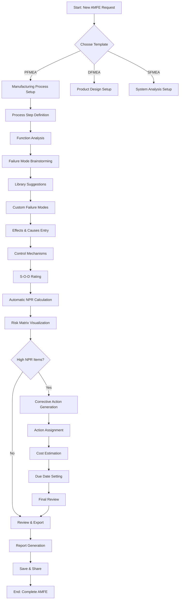
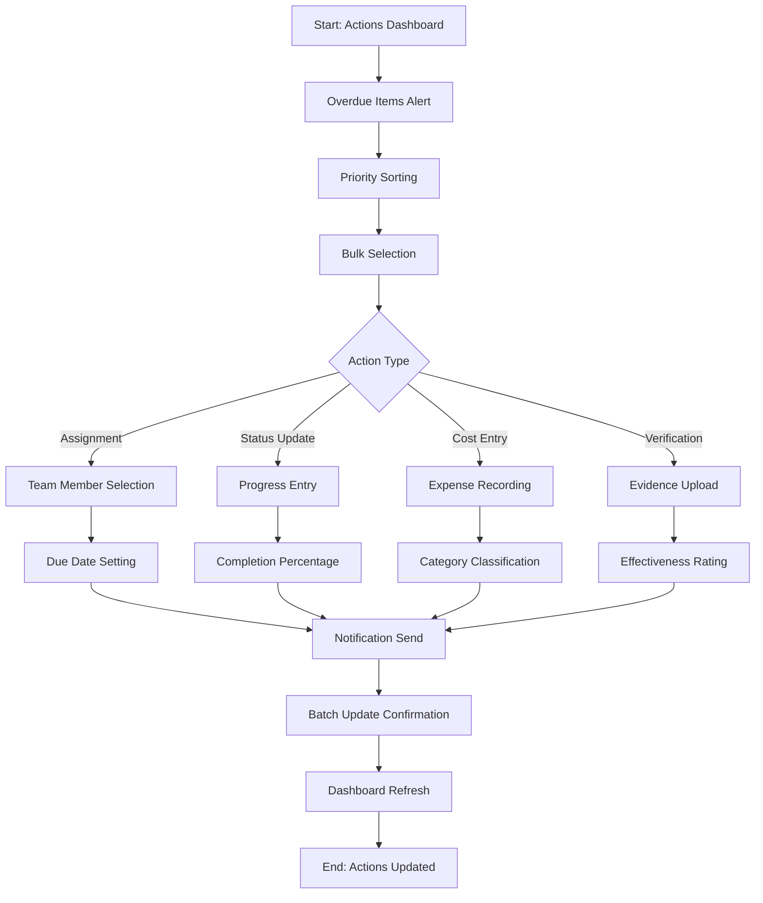
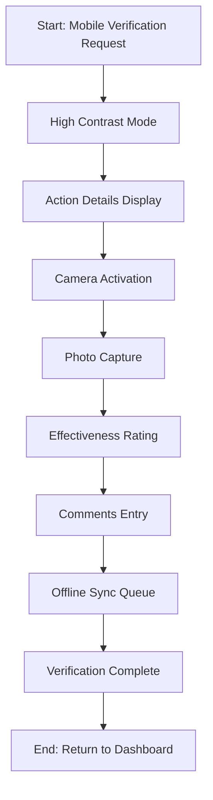

# Herramienta AMFE para Mejora Continua UI/UX Specification

This document defines the user experience goals, information architecture, user flows, and visual design specifications for Herramienta AMFE para Mejora Continua's user interface. It serves as the foundation for visual design and frontend development, ensuring a cohesive and user-centered experience.

## Overall UX Goals & Principles

### Target User Personas

**Primary Persona: Quality Engineer Individual**
- **Context:** Manufacturing quality engineers working individually or in small teams (2-5 people)
- **Experience:** 2-10 years in quality roles, familiar with AMFE methodology
- **Current Pain:** Using Excel/Word for AMFE analysis, frustrated by repetitive tasks and lack of intelligence
- **Behavior:** Manages 5-15 AMFEs simultaneously, needs weekly management presentations
- **Goals:** Professionalize work quality, reduce administrative time, demonstrate value immediately

**Secondary Persona: Independent Quality Consultant**
- **Context:** Consultants serving 3-5 clients simultaneously
- **Challenge:** Maintaining consistency across clients while traveling frequently
- **Need:** Mobile-accessible tool with offline capability and professional reporting
- **Value Driver:** Efficiency directly impacts billing hours and client satisfaction

**Tertiary Persona: Small/Medium Enterprise Quality Manager**
- **Context:** Companies with 50-500 employees, limited budgets for enterprise software
- **Need:** Team collaboration capability without enterprise complexity
- **Constraint:** Cannot justify $5,000+ annual licensing for corporate solutions

### Usability Goals

**Primary Goal: 91% Time Reduction Achievement**
- **Speed of Creation:** New AMFE setup in under 5 minutes vs 30 minutes in Excel
- **Analysis Efficiency:** Complete AMFE analysis in 45 minutes vs 8 hours current baseline
- **Data Entry Speed:** Intelligent suggestions and auto-complete reducing typing by 70%
- **Report Generation:** One-click reports vs manual formatting and assembly

**Supporting Goals:**
- **Error Prevention:** Real-time validation preventing 80% of common data entry errors
- **Learning Curve:** First-time users complete first AMFE in under 1 hour without training
- **Mobile Efficiency:** Quick status checks and photo capture on shop floor in under 2 minutes
- **Offline Continuity:** Seamless work continuity despite connection interruptions

### Design Principles

**1. Speed Over Sophistication**
- Every interaction optimized for the 45-minute completion target
- One-click access to critical actions (new AMFE, calculate NPR, generate report)
- Progressive disclosure - show only what's needed, when it's needed
- Batch operations for power users to handle multiple items efficiently

**2. Engineering Precision Aesthetic**
- Clean, technical interface that feels like a "precision instrument"
- Data density optimized for engineering mindset while maintaining scannability
- Visual hierarchy that guides attention to high-risk items immediately
- Consistent patterns that reduce cognitive load for repeated tasks

**3. Manufacturing Context Awareness**
- Pre-loaded with manufacturing-specific failure modes and industry knowledge
- Interface adapts to shop floor conditions (high contrast, large touch targets)
- Offline-first design acknowledging manufacturing connectivity realities
- Integration with existing quality workflows rather than replacement

**4. Immediate Value Demonstration**
- Users see time savings within first 5 minutes of use
- Visible NPR calculations and risk visualizations update in real-time
- Professional report output from day one, no gradual feature reveal
- Clear ROI tracking showing time saved and risks identified

**5. Accessibility by Default**
- High contrast ratios for varied industrial lighting conditions
- Large touch targets compatible with gloves and industrial settings
- Screen reader compatibility for diverse user needs
- Keyboard-first navigation for power users with accessibility requirements

---

## Information Architecture (IA)

### Site Map / Screen Inventory

```mermaid
graph TD
    A[Login/Landing] --> B[Dashboard - AMFE Command Center]
    A --> C[Quick Start - New AMFE]
    A --> D[Project Library]

    B --> B1[Active AMFEs]
    B --> B2[Risk Overview]
    B --> B3[Actions Pending]
    B --> B4[Quick Actions]

    C --> C1[Template Selection]
    C --> C2[Project Setup]
    C --> C3[AMFE Matrix Editor]

    C3 --> C3a[Function Analysis]
    C3 --> C3b[Failure Mode Entry]
    C3 --> C3b[Effects & Causes]
    C3 --> C3c[Controls & S-O-D]
    C3 --> C3d[NPR Calculation]
    C3 --> C3e[Visual Risk Matrix]

    D --> D1[All Projects]
    D --> D2[Archived Projects]
    D --> D3[Templates]
    D --> D4[Shared Projects]

    E[AMFE Detail View] --> E1[Matrix Editor]
    E --> E2[Risk Visualization]
    E --> E3[Corrective Actions]
    E --> E4[Analysis Tools]

    F[Corrective Actions] --> F1[Action Dashboard]
    F --> F2[Assignment Management]
    F --> F3[Cost Tracking]
    F --> F4[Verification Workflow]

    G[Reports & Analytics] --> G1[Report Generator]
    G --> G2[Executive Dashboard]
    G --> G3[Trend Analysis]
    G --> G4[Export Center]

    H[Settings & Profile] --> H1[User Profile]
    H --> H2[Preferences]
    H --> H3[Library Management]
    H --> H4[Team Settings]
```

### Navigation Structure

**Primary Navigation:** Left sidebar with icon-based navigation optimized for frequent access
- Dashboard (AMFE Command Center)
- Projects (Library & Management)
- Actions (Corrective Actions Hub)
- Analytics (Reports & Insights)
- Library (Failure Modes & Templates)
- Settings (Profile & Preferences)

**Secondary Navigation:** Context-sensitive tabs within each main section
- Within AMFE: Analysis | Actions | Reports | History
- Within Projects: Active | Archived | Templates | Shared
- Within Actions: Pending | In Progress | Completed | Overdue

**Breadcrumb Strategy:** Smart breadcrumbs showing analytical context
- Format: Home > Project Type > Project Name > Current View
- Interactive breadcrumbs allowing quick navigation between related AMFEs
- Context-aware shortcuts based on user's typical workflow patterns

---

## User Flows

### Primary User Flow: Complete AMFE Analysis (45 minutes)

**User Goal:** Create a complete PFMEA analysis for a new manufacturing process with risk identification and corrective action planning

**Entry Points:** Dashboard "New AMFE" button, Projects "Create Project", Quick Start wizard

**Success Criteria:** Complete AMFE with 20+ failure modes, NPR calculations, and 5+ corrective actions assigned within 45 minutes

#### Flow Diagram

#### Edge Cases & Error Handling:
- **Data Loss Prevention:** Auto-save every 30 seconds, recovery on session timeout
- **Validation Errors:** Real-time validation with specific correction guidance
- **Library Overload:** Smart filtering when failure mode library exceeds 100 relevant items
- **Network Interruption:** Offline mode with sync queue, conflict resolution interface
- **Calculation Errors:** NPR calculation validation with manual override option

**Notes:** This flow is optimized for the 45-minute target with intelligent suggestions reducing manual input by 70%

---

### Secondary User Flow: Corrective Action Management (5 minutes)

**User Goal:** Review, assign, and track corrective actions across multiple AMFE projects

**Entry Points:** Dashboard Actions widget, Actions navigation, Email notifications

**Success Criteria:** Process 10+ actions across 3 projects with assignments and status updates in under 5 minutes

#### Flow Diagram

#### Edge Cases & Error Handling:
- **Assignment Conflicts:** Duplicate assignment detection and resolution suggestions
- **Overdue Actions:** Automatic escalation workflows with management notification
- **Budget Overruns:** Cost tracking alerts when approaching action budget limits
- **Evidence Requirements:** Photo/file upload validation for verification compliance
- **Team Availability:** Workload balancing suggestions for new assignments

**Notes:** Flow designed for quick daily management without disrupting primary AMFE analysis work

---

### Tertiary User Flow: Emergency Shop Floor Verification (2 minutes)

**User Goal:** Verify corrective action effectiveness on manufacturing floor with photo evidence

**Entry Points:** Mobile notification, QR code scan, Direct mobile app access

**Success Criteria:** Complete verification with photos and effectiveness rating in under 2 minutes

#### Flow Diagram

#### Edge Cases & Error Handling:
- **Poor Lighting:** Automatic camera adjustment and low-light mode activation
- **Connectivity Loss:** Offline queue with automatic sync when connection restored
- **Glove Compatibility:** Large touch targets and voice input options for industrial settings
- **Language Barriers:** Visual icon-based interface for multilingual shop floors
- **Safety Compliance:** Integration with safety procedures and emergency contacts

**Notes:** Optimized for industrial environments with limited connectivity and need for rapid completion

---

## Component Library / Design System

### Design System Approach

**Design System Approach:** Custom design system built on top of Tailwind CSS with manufacturing-specific components and accessibility-first philosophy. The system prioritizes data density, speed, and industrial context over generic business application patterns.

### Core Components

#### Component: AMFE Matrix Cell

**Purpose:** Intelligent data entry cell that provides validation, suggestions, and real-time feedback while maintaining spreadsheet-like efficiency

**Variants:** Text Input, Numeric Rating, Dropdown Selection, Auto-suggest, Read-only Display

**States:** Default, Focused, Error, Warning, Success, Disabled, Loading, Suggested

**Usage Guidelines:** Use for all AMFE matrix data entry with auto-save on blur, validate on input, show suggestions after 2 characters of typing

---

#### Component: Risk Visualization Widget

**Purpose:** Interactive visualization component for displaying NPR calculations and risk levels across different visual formats

**Variants:** Risk Matrix Scatter Plot, Risk Gauge, Risk Trend Line, Risk Heat Map

**States:** Normal, Alert (High NPR), Loading, Interactive Selection, Zoomed, Filtered

**Usage Guidelines:** Always use color-coded risk levels (green/yellow/red), include tooltips with detailed risk information, enable click-to-filter functionality

---

#### Component: Action Card

**Purpose:** Compact display of corrective action information with assignment tracking and status management

**Variants:** Standard Card, Compact List, Detailed View, Overdue Alert, Completed

**States:** Pending, In Progress, Overdue, Completed, Verified, Archived, Highlighted

**Usage Guidelines:** Show responsible person prominently, include cost tracking fields, enable inline status updates, display verification evidence thumbnails

---

#### Component: Smart Sidebar

**Purpose:** Context-aware assistance panel that provides intelligent suggestions and guidance during AMFE analysis

**Variants:** Failure Mode Suggestions, Effects Library, Cause Analysis, Control Recommendations, Action Templates

**States:** Collapsed, Expanded, Loading, No Results, Error, Active Selection

**Usage Guidelines:** Update content based on current cell context, maintain scroll position during updates, provide one-click adoption of suggestions

---

#### Component: Industrial Button

**Purpose:** Touch-optimized button component designed for shop floor use with gloves and industrial conditions

**Variants:** Primary Action, Secondary Action, Emergency Stop, Quick Action, Icon-only

**States:** Default, Hover, Active, Disabled, Loading, Success, Error, Warning

**Usage Guidelines:** Minimum 44px touch targets, high contrast colors, clear visual feedback, large click areas for accessibility

---

#### Component: Data Table

**Purpose:** High-performance table component optimized for large AMFE datasets with advanced filtering and sorting

**Variants:** AMFE Matrix, Action List, Project Inventory, Risk Summary, Analytics Table

**States:** Loading, Error, Empty, Sorted, Filtered, Selected, Editing

**Usage Guidelines:** Support virtual scrolling for 1000+ rows, enable column customization, include bulk selection capabilities, maintain performance with real-time updates

---

#### Component: Notification Toast

**Purpose:** Non-intrusive notification system for alerts, confirmations, and system updates

**Variants:** Success, Error, Warning, Info, Action Required, System Update

**States:** Entering, Visible, Dismissing, Persistent, Dismissible

**Usage Guidelines:** Auto-dismiss success messages after 3 seconds, keep error messages until dismissed, include action buttons for actionable notifications

---

#### Component: Modal Dialog

**Purpose:** Focused interaction container for complex actions that require user attention and input

**Variants:** Confirmation, Data Entry, Settings, File Upload, Report Preview, Error Details

**States:** Opening, Open, Closing, Loading, Error, Success

**Usage Guidelines:** Always include clear action labels, support keyboard navigation (ESC to close), maintain context of triggering action, prevent background interaction

---

#### Component: Status Badge

**Purpose:** Visual indicator for project and action status with color-coding and priority indication

**Variants:** Project Status, Action Status, Risk Level, Priority, Completion, Team Member

**States:** Draft, In Progress, Review, Complete, Overdue, Critical, High, Medium, Low

**Usage Guidelines:** Use consistent color scheme across all badges, include text labels for accessibility, enable filtering by badge status

---

#### Component: Search Component

**Purpose:** Intelligent search interface with filtering, auto-suggestions, and history management

**Variants:** Global Search, Library Search, Project Search, Action Search, Advanced Filter

**States:** Default, Focused, Loading, Results, No Results, Error, Active Filter

**Usage Guidelines:** Support keyboard shortcuts (Ctrl+K for global search), include search history, provide real-time results, enable complex filter combinations

---

## Accessibility Requirements

### Compliance Target

**Standard:** WCAG 2.1 AA compliance with WCAG AAA targets for critical interface elements. Special emphasis on industrial environment accessibility including high contrast settings, large touch targets, and compatibility with assistive technologies used in manufacturing settings.

### Key Requirements

**Visual:**
- Color contrast ratios: 7:1 for normal text, 4.5:1 for large text, 3:1 for non-text elements
- Focus indicators: 3px solid outline with color contrast of at least 3:1 against background
- Text sizing: Support 200% zoom without loss of functionality, maintain layout integrity
- High contrast mode: Complete high contrast theme for shop floor use with poor lighting

**Interaction:**
- Keyboard navigation: Full keyboard access to all interactive elements, logical tab order, visible focus indicators
- Screen reader support: Complete semantic HTML5 structure, ARIA labels for complex widgets, live regions for dynamic content
- Touch targets: Minimum 44px × 44px for all interactive elements, increased to 48px for critical actions
- Motor accessibility: Large click areas, gesture alternatives, adjustable timing for time-based interactions

**Content:**
- Alternative text: Descriptive alt text for all meaningful images, decorative images marked as aria-hidden
- Heading structure: Proper heading hierarchy (h1-h6) for document structure and navigation
- Form labels: Explicit labels for all form inputs, clear error messages with guidance for correction
- Data tables: Proper table headers, scope attributes, captions for complex AMFE matrices

### Testing Strategy

**Automated Testing:** axe-core integration for continuous accessibility validation in CI/CD pipeline, automated contrast checking, keyboard navigation testing

**Manual Testing:** Monthly accessibility audits with screen readers (NVDA, JAWS, VoiceOver), keyboard-only navigation testing, color blindness simulation testing

**User Testing:** Quarterly accessibility testing with quality engineers who use assistive technologies, shop floor testing with various lighting conditions and physical limitations

---

## Responsiveness Strategy

### Breakpoints

| Breakpoint | Min Width | Max Width | Target Devices |
|------------|-----------|-----------|----------------|
| Mobile | 320px | 767px | smartphones in portrait, small tablets |
| Tablet | 768px | 1023px | tablets, large phones in landscape |
| Desktop | 1024px | 1439px | laptops, small desktop monitors |
| Wide | 1440px | - | large desktop monitors, external displays |

### Adaptation Patterns

**Layout Changes:**
- Mobile: Single column layout with collapsible navigation, vertical stacking of components
- Tablet: Two-column layout with sidebar navigation, adaptive data tables with horizontal scrolling
- Desktop: Multi-column layout with persistent sidebar, full-width data tables with column pinning
- Wide: Enhanced dashboard with additional analytics panels, side-by-side document editing

**Navigation Changes:**
- Mobile: Bottom tab bar for primary navigation, hamburger menu for secondary options
- Tablet: Left sidebar navigation, dropdown menus for secondary navigation
- Desktop: Full sidebar with icons and text, keyboard shortcuts for power users

**Content Priority:**
- Mobile: Prioritize critical AMFE data and actions, hide advanced analytics panels
- Tablet: Balance between data entry and analysis, selective display of supporting information
- Desktop: Full feature access with comprehensive data visualization and analysis tools

**Interaction Changes:**
- Mobile: Touch-optimized controls, swipe gestures for navigation, voice input options
- Tablet: Mixed touch and keyboard interaction, gesture support for data manipulation
- Desktop: Keyboard-first navigation, drag-and-drop functionality, right-click context menus

---

## Animation & Micro-interactions

### Motion Principles

**Motion Principles:** Functional animation that enhances understanding and provides feedback without compromising performance. All animations follow manufacturing standards for clarity and precision, with motion used to indicate state changes, guide attention, and provide feedback on user actions. Animation duration limited to 200-300ms for immediate feedback, 500ms for major transitions.

### Key Animations

- **NPR Calculation Update:** Smooth color transition when NPR values change (Duration: 300ms, Easing: ease-out)
- **Risk Matrix Interaction:** Animated scatter plot points with hover effects and selection states (Duration: 200ms, Easing: ease-in-out)
- **Action Status Changes:** Progress bar animations and status badge transitions (Duration: 400ms, Easing: ease-out)
- **Data Entry Validation:** Subtle shake animation for errors, highlight for successful validation (Duration: 200ms, Easing: ease-in-out)
- **Loading States:** Skeleton screens with progressive content loading (Duration: 800ms, Easing: ease-in-out)
- **Modal Transitions:** Fade and slide animations for dialog appearance (Duration: 250ms, Easing: ease-out)
- **Navigation Transitions:** Smooth page transitions with breadcrumb updates (Duration: 200ms, Easing: ease-in-out)
- **Success Feedback:** Checkmark animations and color transitions for completed actions (Duration: 500ms, Easing: ease-out)

---

## Performance Considerations

### Performance Goals

- **Page Load:** Initial page load under 3 seconds, First Contentful Paint under 1.5 seconds
- **Interaction Response:** User interface interactions under 200ms, complex calculations under 500ms
- **Animation FPS:** Maintain 60fps for all animations, reduce to 30fps on lower-end devices

### Design Strategies

**Image Optimization:** WebP format for photographs, SVG for icons and graphics, lazy loading for below-the-fold images, responsive images with appropriate sizing

**Component Optimization:** Virtual scrolling for large data tables, memoization for expensive calculations, code splitting for non-critical features, progressive enhancement for advanced functionality

**Animation Performance:** CSS transforms and opacity for smooth animations, requestAnimationFrame for JavaScript animations, reduced motion preferences respected

**Data Loading:** Progressive data loading for AMFE matrices, optimistic updates for better perceived performance, intelligent caching strategies for frequently accessed data

---

## Next Steps

### Immediate Actions

1. **Create detailed Figma designs** for the 5 key screens identified in wireframes section
2. **Develop component library** in Storybook with all 10 core components
3. **Conduct user testing** with target quality engineers to validate design assumptions
4. **Perform accessibility audit** using automated tools and manual testing with screen readers
5. **Validate performance targets** with prototype testing on various devices and network conditions

### Design Handoff Checklist

- [ ] All user flows documented with interaction specifications
- [ ] Component inventory complete with variant and state definitions
- [ ] Accessibility requirements defined and validated
- [ ] Responsive strategy clear with breakpoint specifications
- [ ] Brand guidelines incorporated across all design elements
- [ ] Performance goals established with optimization strategies
- [ ] Animation specifications defined with timing and easing functions
- [ ] Manufacturing context requirements addressed in all interface elements

---

## Change Log

| Date | Version | Description | Author |
|------|---------|-------------|---------|
| 2025-10-31 | v1.0 | Initial UI/UX specification creation | Sally (UX Expert) |