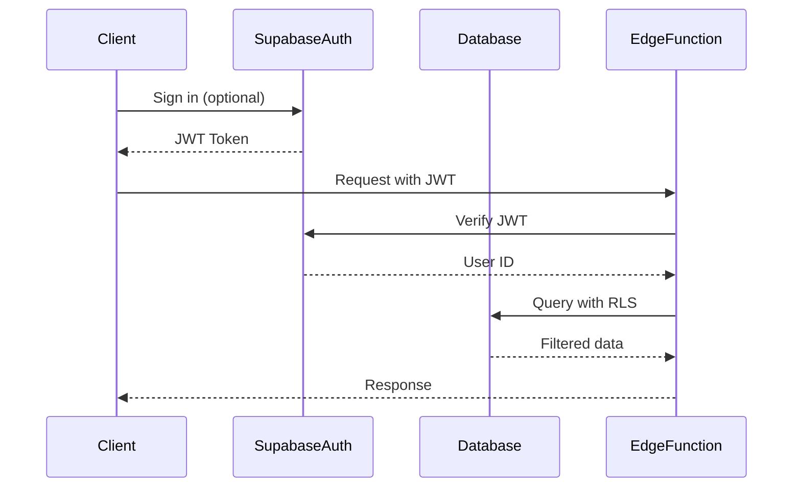

# Backend Architecture

The backend leverages Supabase's serverless infrastructure to provide database, authentication, storage, and edge functions without managing servers. This approach minimizes operational overhead while maintaining scalability.

## Service Architecture

### Serverless Architecture

Since we're using Supabase as our backend platform, the architecture consists of:

1. **PostgreSQL Database** - Core data storage with Row Level Security
2. **Supabase Auth** - Optional user authentication
3. **Supabase Storage** - File storage for evidence and exports
4. **Supabase Edge Functions** - Custom business logic when needed
5. **Supabase Realtime** - Live synchronization between devices

### Function Organization

```
functions/
├── _shared/
│   ├── cors.ts          # CORS handling
│   ├── auth.ts          # Authentication middleware
│   └── errors.ts        # Error handling utilities
├── exports/
│   ├── pdf-generator.ts # PDF report generation
│   └── excel-export.ts  # Excel export with formulas
├── notifications/
│   ├── email-sender.ts  # Action due notifications
│   └── digest.ts        # Daily/weekly summaries
└── migrations/
    ├── 001_initial.sql  # Database schema
    ├── 002_rls.sql      # Row Level Security
    └── 003_indexes.sql  # Performance indexes
```

### Function Template

```typescript
// functions/exports/pdf-generator.ts
import { serve } from 'https://deno.land/std@0.177.0/http/server.ts';
import { createClient } from 'https://esm.sh/@supabase/supabase-js@2.38.4';
import { PDFDocument, rgb, StandardFonts } from 'https://cdn.skypack.dev/pdf-lib@1.17.1';

const corsHeaders = {
  'Access-Control-Allow-Origin': '*',
  'Access-Control-Allow-Headers': 'authorization, x-client-info, apikey, content-type',
};

serve(async (req) => {
  // Handle CORS preflight
  if (req.method === 'OPTIONS') {
    return new Response('ok', { headers: corsHeaders });
  }

  try {
    const supabaseClient = createClient(
      Deno.env.get('SUPABASE_URL') ?? '',
      Deno.env.get('SUPABASE_ANON_KEY') ?? '',
      {
        global: {
          headers: { Authorization: req.headers.get('Authorization')! },
        },
      }
    );

    const { amfeId, includeActions = true } = await req.json();

    // Fetch AMFE data
    const { data: amfe, error } = await supabaseClient
      .from('amfes')
      .select(`
        *,
        amfe_items (
          row_number,
          function,
          failure_mode,
          failure_effect,
          failure_cause,
          current_controls,
          severity,
          occurrence,
          detection,
          npr,
          risk_level,
          notes
        ),
        corrective_actions (
          description,
          responsible,
          due_date,
          cost_estimated,
          cost_actual,
          status,
          completion_date,
          notes
        )
      `)
      .eq('id', amfeId)
      .single();

    if (error) throw error;

    // Generate PDF
    const pdfDoc = await PDFDocument.create();
    const font = await pdfDoc.embedFont(StandardFonts.Helvetica);
    const boldFont = await pdfDoc.embedFont(StandardFonts.HelveticaBold);

    // Add title page
    const page = pdfDoc.addPage([612, 792]); // Letter size
    const { width, height } = page.getSize();

    page.drawText(`AMFE: ${amfe.name}`, {
      x: 50,
      y: height - 50,
      size: 20,
      font: boldFont,
    });

    page.drawText(`Type: ${amfe.type} | Status: ${amfe.status}`, {
      x: 50,
      y: height - 80,
      size: 12,
      font,
    });

    // Add AMFE matrix table
    let yPosition = height - 150;
    const tableHeaders = [
      '#', 'Function', 'Failure Mode', 'Effect', 'Cause',
      'S', 'O', 'D', 'NPR', 'Risk Level'
    ];

    // Draw headers
    tableHeaders.forEach((header, index) => {
      page.drawText(header, {
        x: 50 + (index * 50),
        y: yPosition,
        size: 10,
        font: boldFont,
      });
    });

    yPosition -= 20;

    // Draw items
    amfe.amfe_items?.forEach((item: any) => {
      // Truncate long text
      const drawText = (text: string, x: number, y: number, maxWidth: number) => {
        const truncated = text.length > 20 ? text.substring(0, 17) + '...' : text;
        page.drawText(truncated, { x, y, size: 9, font });
      };

      drawText(item.row_number.toString(), 50, yPosition, 30);
      drawText(item.function, 100, yPosition, 150);
      drawText(item.failure_mode, 200, yPosition, 100);
      drawText(item.severity.toString(), 450, yPosition, 20);
      drawText(item.occurrence.toString(), 480, yPosition, 20);
      drawText(item.detection.toString(), 510, yPosition, 20);

      const nprText = item.npr.toString();
      const nprColor = item.npr >= 240 ? rgb(1, 0, 0) :
                      item.npr >= 120 ? rgb(1, 0.5, 0) :
                      item.npr >= 60 ? rgb(1, 1, 0) : rgb(0, 0.5, 0);

      page.drawText(nprText, {
        x: 540,
        y: yPosition,
        size: 9,
        font: boldFont,
        color: nprColor,
      });

      yPosition -= 15;

      // Add new page if needed
      if (yPosition < 50) {
        pdfDoc.addPage([612, 792]);
        yPosition = height - 50;
      }
    });

    // Serialize PDF
    const pdfBytes = await pdfDoc.save();

    // Return PDF
    return new Response(pdfBytes, {
      headers: {
        ...corsHeaders,
        'Content-Type': 'application/pdf',
        'Content-Disposition': `attachment; filename="amfe-${amfe.name}.pdf"`,
      },
    });

  } catch (error) {
    return new Response(JSON.stringify({ error: error.message }), {
      status: 400,
      headers: { ...corsHeaders, 'Content-Type': 'application/json' },
    });
  }
});
```

## Database Architecture

### Schema Design

The database schema was previously defined in the Database Schema section. Key architectural decisions:

1. **Generated Columns** for automatic NPR and risk calculations
2. **Row Level Security** for multi-tenant data isolation
3. **JSONB fields** for flexible metadata storage
4. **Trigger-based timestamps** for audit trails
5. **Optimized indexes** for query performance

### Data Access Layer

```typescript
// functions/_shared/database.ts
import { createClient } from 'https://esm.sh/@supabase/supabase-js@2.38.4';
import { Database } from '../types/database.ts';

export function createSupabaseClient(authHeader?: string) {
  return createClient<Database>(
    Deno.env.get('SUPABASE_URL')!,
    Deno.env.get('SUPABASE_SERVICE_ROLE_KEY')!,
    {
      auth: {
        autoRefreshToken: false,
        persistSession: false,
      },
      global: {
        headers: authHeader ? { Authorization: authHeader } : {},
      },
    }
  );
}

export class DatabaseService {
  private supabase: ReturnType<typeof createSupabaseClient>;

  constructor(authHeader?: string) {
    this.supabase = createSupabaseClient(authHeader);
  }

  // AMFE operations with proper error handling
  async getAMFEWithItems(id: string) {
    const { data, error } = await this.supabase
      .from('amfes')
      .select(`
        *,
        amfe_items (
          id,
          row_number,
          function,
          failure_mode,
          failure_effect,
          failure_cause,
          current_controls,
          severity,
          occurrence,
          detection,
          npr,
          risk_level,
          notes
        )
      `)
      .eq('id', id)
      .single();

    if (error) {
      throw new Error(`Failed to fetch AMFE: ${error.message}`);
    }

    return data;
  }

  async updateAMFEStatus(id: string, status: string, userId?: string) {
    const { error } = await this.supabase
      .from('amfes')
      .update({
        status,
        updated_at: new Date().toISOString()
      })
      .eq('id', id)
      .eq('created_by', userId); // RLS check

    if (error) {
      throw new Error(`Failed to update AMFE: ${error.message}`);
    }
  }

  // Batch operations for performance
  async batchUpdateItems(items: Database['public']['Tables']['amfe_items']['Update'][]) {
    const { data, error } = await this.supabase
      .from('amfe_items')
      .upsert(items, {
        onConflict: 'id',
        ignoreDuplicates: false
      })
      .select();

    if (error) {
      throw new Error(`Batch update failed: ${error.message}`);
    }

    return data;
  }
}
```

## Authentication and Authorization

### Auth Flow



### Middleware/Guards

```typescript
// functions/_shared/auth.ts
import { createClient } from 'https://esm.sh/@supabase/supabase-js@2.38.4';

export interface AuthUser {
  id: string;
  email?: string;
  role?: string;
}

export async function verifyAuth(req: Request): Promise<AuthUser | null> {
  const authHeader = req.headers.get('Authorization');

  if (!authHeader || !authHeader.startsWith('Bearer ')) {
    // Allow anonymous access for certain operations
    return null;
  }

  const token = authHeader.replace('Bearer ', '');

  const supabase = createClient(
    Deno.env.get('SUPABASE_URL')!,
    Deno.env.get('SUPABASE_SERVICE_ROLE_KEY')!
  );

  const { data: { user }, error } = await supabase.auth.getUser(token);

  if (error || !user) {
    throw new Error('Invalid or expired token');
  }

  return {
    id: user.id,
    email: user.email,
    role: user.user_metadata?.role,
  };
}

// Usage in edge functions
export async function withAuth(
  req: Request,
  handler: (user: AuthUser | null) => Promise<Response>
) {
  try {
    const user = await verifyAuth(req);
    return await handler(user);
  } catch (error) {
    return new Response(
      JSON.stringify({ error: 'Unauthorized' }),
      {
        status: 401,
        headers: { 'Content-Type': 'application/json' }
      }
    );
  }
}
```

---

**Backend Architecture Decisions:**

1. **Serverless First:** Leverage Supabase to eliminate infrastructure management
2. **Progressive Auth:** Support both authenticated and anonymous usage
3. **Edge Computing:** Use Deno-based edge functions for custom logic
4. **Database-Centric:** Let PostgreSQL handle business rules where possible
5. **Security by Default:** Row Level Security at database level
