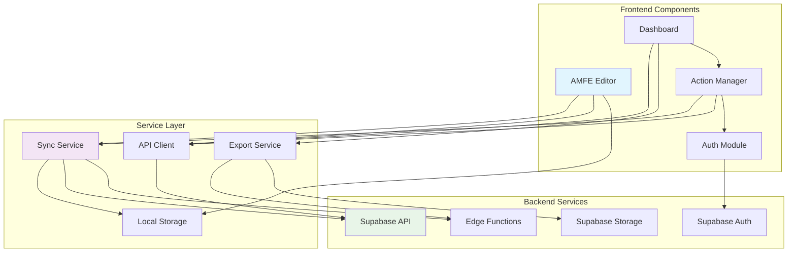

# Components

Based on the architectural patterns and tech stack, here are the major logical components across the fullstack:

## AMFE Editor Component

**Responsibility:** Core spreadsheet-like interface for editing AMFE matrices with real-time NPR calculations and Excel-like navigation.

**Key Interfaces:**
- `updateCell(rowId, field, value)` - Update individual cell values
- `addRow(position)` - Insert new row at specific position
- `deleteRow(rowId)` - Remove row with confirmation
- `calculateNPR(severity, occurrence, detection)` - Auto-calculate risk priority
- `validateInput(field, value)` - Input validation for ratings

**Dependencies:** AMFE data store, Failure Mode library, State management
**Technology Stack:** React + TypeScript, Zustand for state, Tailwind CSS for styling

## Action Management Component

**Responsibility:** Manages corrective actions lifecycle including creation, status tracking, cost updates, and evidence attachment.

**Key Interfaces:**
- `createAction(amfeItemId, actionData)` - Create new corrective action
- `updateStatus(actionId, status)` - Update action status with workflow validation
- `updateCosts(actionId, costs)` - Track estimated vs actual costs
- `attachEvidence(actionId, files)` - Upload and manage evidence files
- `calculateROI(actionId)` - Calculate return on investment

**Dependencies:** Corrective Actions API, File Storage Service, Notification Service
**Technology Stack:** React + TypeScript, React Hook Form for validation, Supabase Storage

## Dashboard Component

**Responsibility:** Central view showing all AMFEs, action summaries, visual analytics, and key metrics for management review.

**Key Interfaces:**
- `fetchAMFEs(filters)` - Retrieve filtered AMFE list
- `fetchMetrics(dateRange)` - Get dashboard metrics
- `exportReports(type, filters)` - Generate PDF/Excel reports
- `updateFilters(filters)` - Apply dashboard filters

**Dependencies:** AMFE API, Actions API, Charts Library, Export Service
**Technology Stack:** React + TypeScript, Recharts for visualization, PDF generation library

## Sync Service Component

**Responsibility:** Handles offline/online synchronization, conflict resolution, and data persistence between IndexedDB and Supabase.

**Key Interfaces:**
- `syncToCloud()` - Push local changes to Supabase
- `syncFromCloud()` - Pull remote changes
- `detectConflicts(local, remote)` - Identify data conflicts
- `resolveConflict(strategy)` - Apply conflict resolution strategy

**Dependencies:** IndexedDB, Supabase Client, Network Status API
**Technology Stack:** TypeScript, Service Worker, IndexedDB, Supabase JS

## Authentication Component

**Responsibility:** Optional user authentication for cloud sync with anonymous mode support and progressive authentication.

**Key Interfaces:**
- `signIn(email, password)` - User authentication
- `signOut()` - End user session
- `createAccount(userData)` - New user registration
- `resetPassword(email)` - Password recovery

**Dependencies:** Supabase Auth, Local Storage for preferences
**Technology Stack:** React + TypeScript, Supabase Auth, React Context

## Export Service Component

**Responsibility:** Generates professional PDF and Excel reports with custom formatting, charts, and company branding.

**Key Interfaces:**
- `generatePDF(amfeId, options)` - Create PDF report
- `generateExcel(amfeId, options)` - Create Excel workbook
- `previewReport(amfeId, type)` - Report preview
- `scheduleExport(amfeId, schedule)` - Scheduled report generation

**Dependencies:** Report generation libraries, File system, AMFE data access
**Technology Stack:** TypeScript, PDF-lib (client-side) or Supabase Edge Function, ExcelJS

## Component Diagrams

---

**Key Architectural Decisions:**

1. **Component Isolation:** Each component has clear boundaries with defined interfaces
2. **Service Layer Abstraction:** All external communication goes through service layer
3. **Progressive Enhancement:** Core functionality works offline, enhanced features with connection
4. **Type Safety:** Shared TypeScript interfaces ensure consistency across components
5. **Performance Optimization:** Components use lazy loading and memoization for large datasets
