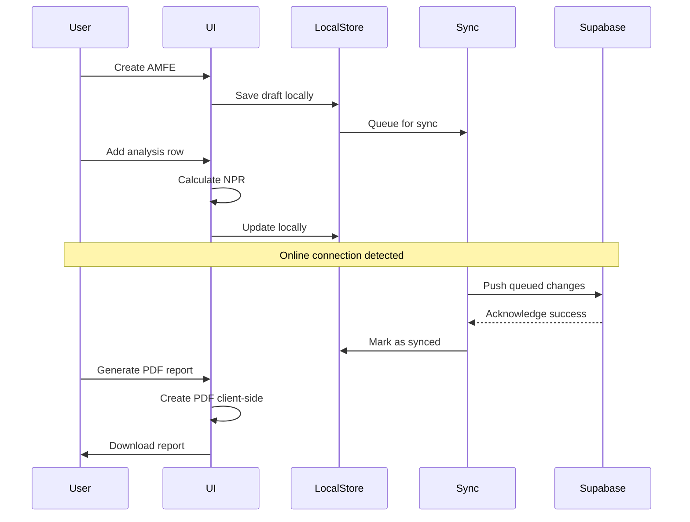
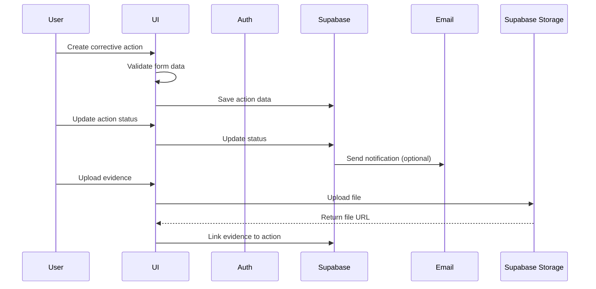

# Core Workflows

```mermaid
sequenceDiagram
    participant User
    participant UI
    participant LocalStore
    participant Sync
    participant Supabase

    User->>UI: Create AMFE
    UI->>LocalStore: Save draft locally
    LocalStore->>Sync: Queue for sync

    User->>UI: Add analysis row
    UI->>UI: Calculate NPR
    UI->>LocalStore: Update locally

    Note over User,Supabase: Online connection detected
    Sync->>Supabase: Push queued changes
    Supabase-->>Sync: Acknowledge success
    Sync->>LocalStore: Mark as synced

    User->>UI: Generate PDF report
    UI->>UI: Create PDF client-side
    UI->>User: Download report
```

```mermaid
sequenceDiagram
    participant User
    participant UI
    participant Auth
    participant Supabase
    participant Email

    User->>UI: Create corrective action
    UI->>UI: Validate form data
    UI->>Supabase: Save action data

    User->>UI: Update action status
    UI->>Supabase: Update status
    Supabase->>Email: Send notification (optional)

    User->>UI: Upload evidence
    UI->>Supabase Storage: Upload file
    Supabase Storage-->>UI: Return file URL
    UI->>Supabase: Link evidence to action
```

---
