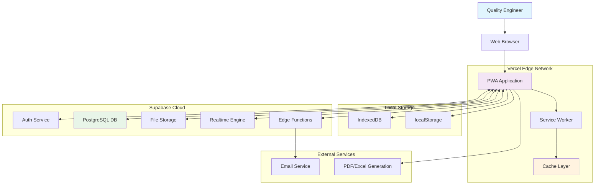

# High Level Architecture

## Technical Summary

The AMFE tool implements a serverless-first Jamstack architecture leveraging Supabase for backend-as-a-service and Vercel for edge deployment. The React frontend utilizes TypeScript for type safety across the fullstack, with Tailwind CSS providing responsive design and Headless UI ensuring accessibility. Local storage combined with Supabase sync enables offline capability while maintaining cloud persistence, all optimized to maintain sub-3-second load times and a bundle size under 5MB.

## Platform and Infrastructure Choice

**Selected Platform:** **Supabase + Vercel**

**Key Services:**
- **Frontend Hosting:** Vercel Edge Network
- **Database:** Supabase PostgreSQL (Free Tier)
- **Authentication:** Supabase Auth (optional)
- **File Storage:** Supabase Storage
- **Edge Functions:** Supabase Edge Functions
- **Real-time Sync:** Supabase Realtime

**Deployment Host and Regions:**
- **Frontend:** Vercel's global edge network (automatic region selection)
- **Backend:** Supabase AWS (us-east-1 region)

**Rationale for Choice:**
1. **Cost Optimization:** Free tier supports 100 users, aligning with MVP goals
2. **Development Speed:** Backend-as-a-service eliminates infrastructure setup
3. **Scalability:** Serverless architecture scales automatically with usage
4. **Performance:** Global CDN ensures fast loading across manufacturing sites
5. **Offline Support:** Local storage + sync strategy works well with Supabase APIs

## Repository Structure

**Structure:** Monorepo
**Monorepo Tool:** npm workspaces (simplest approach)
**Package Organization:**
- `/frontend` - React application
- `/functions` - Supabase Edge Functions (if needed)
- `/docs` - Documentation and architecture
- `/shared` - Shared types and utilities (future)

## Architecture Diagram

## Architectural Patterns

- **Progressive Web App (PWA):** Native-like experience with offline capabilities - _Rationale:_ Essential for manufacturing floor environments with unreliable connectivity
- **Offline-First Architecture:** Local storage as primary source, sync to cloud - _Rationale:_ Ensures continuous operation in plant environments
- **Repository Pattern:** Abstract data access through service layer - _Rationale:_ Enables testing and future database migration flexibility
- **Component-Based UI:** Reusable React components with TypeScript - _Rationale:_ Maintainability and type safety across engineering data
- **State Management with Zustand:** Simple, predictable state handling - _Rationale:_ Minimal boilerplate while maintaining predictability
- **Serverless Backend:** Edge functions for compute needs - _Rationale:_ Cost-effective scaling for sporadic usage patterns
- **Real-time Synchronization:** Automatic multi-device sync - _Rationale:_ Seamless experience between desktop and mobile devices
