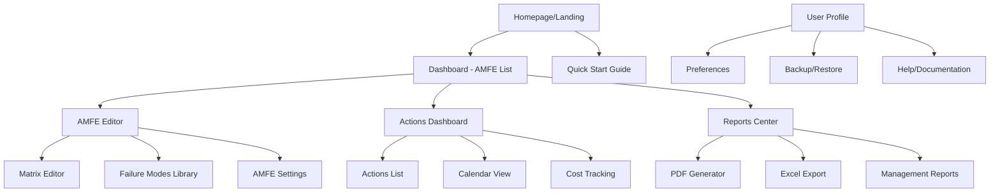
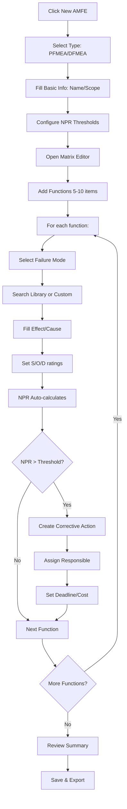
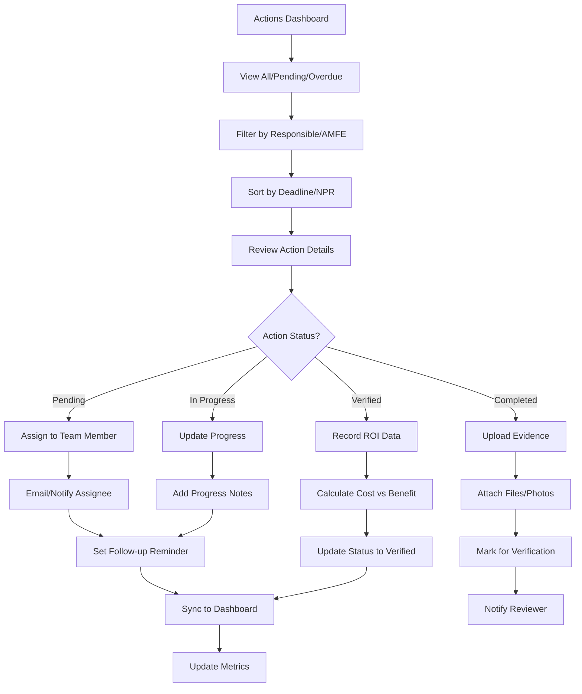
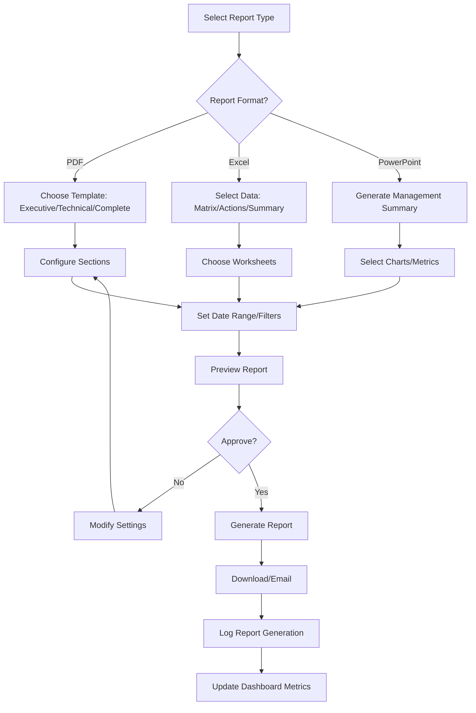

# Herramienta AMFE para Mejora Continua - UI/UX Specification

## Introduction

Based on the PRD for the AMFE tool, I can see this is a web-based FMEA (Failure Mode and Effects Analysis) application designed for quality engineers in manufacturing. The tool aims to reduce analysis time from 8 hours to 45 minutes while providing a professional, accessible solution.

This document defines the user experience goals, information architecture, user flows, and visual design specifications for the AMFE tool. It serves as the foundation for visual design and frontend development, ensuring a cohesive and user-centered experience.

### Overall UX Goals & Principles

Based on the PRD analysis, I'm defining the user experience foundation:

**Target User Personas:**
- **Quality Engineer:** Technical professionals (30-50 years old) familiar with Excel, FMEA methodology, and manufacturing processes. Values efficiency and accuracy.
- **Plant Manager:** Decision makers who need high-level insights and reports for presentations. Focus on ROI and risk mitigation.
- **Field Engineer:** Users needing mobile access to view and update data on shop floor with potential connectivity issues.

**Usability Goals:**
- **Learning Curve:** New users complete first FMEA within 30 minutes without training
- **Efficiency:** Reduce FMEA creation time from 8 hours to 45 minutes (90% reduction)
- **Error Prevention:** Clear validation and auto-calculation prevent common data entry errors
- **Data Integrity:** Auto-save and offline sync ensure no work is ever lost

**Design Principles:**
1. **Excel familiarity with modern power** - Maintain familiar spreadsheet interaction while adding intelligent automation
2. **Progressive disclosure** - Show complexity only when needed, keeping interface clean
3. **Professional minimalism** - Clean, data-dense interface that inspires engineering confidence
4. **Instant feedback** - Every action provides immediate visual response
5. **Accessibility first** - WCAG AA compliance for corporate environments

### Change Log

| Date | Version | Description | Author |
|------|---------|-------------|--------|
| 2025-10-31 | 1.0 | Initial front-end specification based on PRD | Sally (UX Expert) |

## Information Architecture (IA)

Based on the user journey and PRD requirements, I'm designing the information architecture:

### Site Map / Screen Inventory

### Navigation Structure

**Primary Navigation:** Left sidebar (desktop) or bottom tab bar (mobile) with:
- Dashboard (home icon)
- AMFEs (grid icon)
- Actions (checklist icon)
- Reports (chart icon)
- Settings (gear icon)

**Secondary Navigation:** Contextual top navigation based on current view:
- For AMFEs: Create | Edit | Duplicate | Export
- For Actions: Filter | Sort | Calendar | Assign
- For Reports: Generate | Schedule | Templates

**Breadcrumb Strategy:** Simple linear breadcrumbs for deep navigation
Dashboard > AMFE Name > Edit Matrix
Dashboard > Actions > Filter Results

## User Flows

Based on the PRD requirements and user journey analysis, here are the critical user flows:

### Flow 1: Creating a New AMFE Analysis

**User Goal:** Complete a full FMEA analysis from scratch in 45 minutes or less

**Entry Points:** Dashboard "New AMFE" button, Homepage quick start, or menu navigation

**Success Criteria:** User creates complete FMEA with at least 10 failure modes and assigns 3+ corrective actions

#### Flow Diagram

#### Edge Cases & Error Handling:
- **Network loss during editing:** Auto-save to localStorage, sync when online
- **Invalid NPR ratings:** Inline validation with visual indicators
- **Duplicate failure modes:** Suggest similar existing modes
- **Large data entry:** Auto-save every 30 seconds, prevent data loss

#### Notes:
Flow designed for 45-minute completion time target with intelligent suggestions and keyboard shortcuts throughout.

### Flow 2: Managing Corrective Actions

**User Goal:** Track all corrective actions across multiple AMFEs to ensure risk mitigation

**Entry Points:** Dashboard actions widget, AMFE editor action buttons, dedicated Actions dashboard

**Success Criteria:** All high-NPR actions have assigned owners, deadlines, and progress tracking

#### Flow Diagram

#### Edge Cases & Error Handling:
- **Missed deadlines:** Automatic escalation emails to manager
- **File upload failures:** Retry mechanism and size validation
- **Multiple assignees:** Allow co-ownership with primary responsibility
- **Cost data conflicts:** Show cost history with change audit trail

#### Notes:
Integration with calendar systems for deadline management and automated reporting to stakeholders for high-risk items.

### Flow 3: Generating Management Reports

**User Goal:** Create professional reports for stakeholder presentations and compliance documentation

**Entry Points:** Reports center, AMFE detail page export button, dashboard quick export

**Success Criteria:** Professional PDF/Excel reports generated with custom branding and complete data

#### Flow Diagram

#### Edge Cases & Error Handling:
- **Large report generation:** Show progress indicator with estimated time
- **Missing data:** Highlight incomplete sections before generation
- **Template customization errors:** Revert to default template with warning
- **Export failures:** Offer alternative formats or retry options

#### Notes:
Reports should include automated insights like "Top 5 risks" and "ROI of implemented actions" for executive presentations.

## Wireframes & Mockups

**Primary Design Files:** Will be created in Figma (link to be provided)

### Key Screen Layouts

#### Screen 1: AMFE Dashboard

**Purpose:** Central hub showing all AMFE analyses and quick insights

**Key Elements:**
- Header with user profile and notifications
- Stats cards: Total AMFEs, Critical NPRs, Pending Actions, Average NPR
- AMFE list with color-coded risk indicators
- Quick actions: New AMFE, Import, Export All
- Recent activity timeline

**Interaction Notes:**
- Click AMFE card to open editor
- Hover shows quick stats and last modified
- Filter/sort controls above list
- Real-time updates for actions due

**Design File Reference:** [Figma Frame: Dashboard]

#### Screen 2: AMFE Matrix Editor

**Purpose:** Main workspace for creating and editing FMEA analysis

**Key Elements:**
- Toolbar: Save, Export, Add Row, Library, Calculate
- Editable spreadsheet matrix with frozen headers
- Side panel with NPR summary and quick actions
- Auto-suggest dropdown for failure modes
- Keyboard shortcut hints
- Status indicator (saving/saved/offline)

**Interaction Notes:**
- Tab navigation between cells
- Auto-save on cell exit
- Color-coded NPR cells (red > 100, yellow 50-100, green < 50)
- Right-click context menu for row actions
- Library search with keyboard shortcuts

**Design File Reference:** [Figma Frame: Matrix Editor]

#### Screen 3: Actions Management Dashboard

**Purpose:** Track all corrective actions across projects

**Key Elements:**
- Filter bar: Status, Responsible, Due Date, AMFE
- Action cards with progress indicators
- Calendar view toggle
- Cost summary section
- Bulk actions toolbar

**Interaction Notes:**
- Drag to change status
- Click to expand details
- Email reminders integration
- Upload evidence via drag-drop

**Design File Reference:** [Figma Frame: Actions Dashboard]

#### Screen 4: Reports Generator

**Purpose:** Create and customize professional reports

**Key Elements:**
- Report type selector
- Template gallery with previews
- Configuration panel
- Preview pane
- Export options

**Interaction Notes:**
- Live preview as settings change
- Brand customization options
- Scheduled reports setup
- Multi-format export

**Design File Reference:** [Figma Frame: Reports]

---

## Component Library / Design System

**Design System Approach:** Custom design system inspired by Material Design and Ant Design, optimized for data-intensive applications

### Core Components

#### Component 1: DataTable Pro

**Purpose:** Enhanced data table for FMEA matrix with Excel-like capabilities

**Variants:**
- Standard view (full edit)
- Read-only view (review mode)
- Compact view (mobile)

**States:**
- Default (normal interaction)
- Editing (cell active)
- Validating (showing errors)
- Loading (skeleton state)
- Disabled (read-only mode)

**Usage Guidelines:**
- Always show column headers
- Use keyboard navigation for accessibility
- Show save indicator clearly
- Color-code NPR values based on risk level

#### Component 2: ActionCard

**Purpose:** Display corrective action with progress tracking

**Variants:**
- Card view (dashboard)
- List view (table)
- Compact view (widget)

**States:**
- Pending (yellow accent)
- In Progress (blue accent)
- Completed (green accent)
- Overdue (red accent)

**Usage Guidelines:**
- Always show due date prominently
- Include responsible person
- Show progress bar for completion
- Allow status change via drag-drop

#### Component 3: MetricCard

**Purpose:** Display KPIs and summary statistics

**Variants:**
- Large (hero metric)
- Medium (standard dashboard)
- Small (widget)

**States:**
- Normal
- Loading (skeleton)
- Error (failed to load)
- Alert (threshold exceeded)

**Usage Guidelines:**
- Include trend indicator when available
- Use clear, large typography
- Show comparison to previous period
- Add tooltip for explanation

#### Component 4: FilterBar

**Purpose:** Advanced filtering with multiple criteria

**Variants:**
- Inline (in dashboard)
- Modal (full screen)
- Sidebar (persistent)

**States:**
- Collapsed
- Expanded
- Active (filters applied)

**Usage Guidelines:**
- Show active filters as pills
- Include clear all option
- Save frequently used filter sets
- Provide search for long lists

---

## Branding & Style Guide

**Brand Guidelines:** New brand created for professional engineering tools

### Color Palette

| Color Type | Hex Code | Usage |
|------------|----------|-------|
| Primary | #1E3A8A | Header, primary buttons, navigation |
| Secondary | #F3F4F6 | Background, cards, content areas |
| Accent | #EA580C | Alerts, critical NPRs, call-to-action |
| Success | #16A34A | Completed actions, positive indicators |
| Warning | #F59E0B | Medium NPRs, upcoming deadlines |
| Error | #DC2626 | Critical errors, missed deadlines |
| Neutral | #6B7280 | Secondary text, borders, disabled states |

### Typography

#### Font Families
- **Primary:** Inter, system-ui, sans-serif
- **Secondary:** Roboto Mono, monospace (for data)
- **Monospace:** JetBrains Mono (for code/technical fields)

#### Type Scale

| Element | Size | Weight | Line Height |
|---------|------|--------|-------------|
| H1 | 32px | 700 | 1.2 |
| H2 | 24px | 600 | 1.3 |
| H3 | 20px | 600 | 1.4 |
| Body | 16px | 400 | 1.5 |
| Small | 14px | 400 | 1.4 |

### Iconography

**Icon Library:** Heroicons + Custom engineering icons

**Usage Guidelines:**
- Use consistent stroke width (2px)
- Maintain 24x24px grid for consistency
- Color icons according to semantic meaning
- Add tooltips for abstract icons

### Spacing & Layout

**Grid System:** 8px baseline grid with 24px columns

**Spacing Scale:**
- XS: 4px
- SM: 8px
- MD: 16px
- LG: 24px
- XL: 32px
- 2XL: 48px

---

## Accessibility Requirements

### Compliance Target
**Standard:** WCAG 2.1 AA

### Key Requirements

**Visual:**
- Color contrast ratios: 4.5:1 for normal text, 3:1 for large text
- Focus indicators: 2px solid #1E3A8A with 3px offset
- Text sizing: Support up to 200% zoom without breaking layout

**Interaction:**
- Keyboard navigation: Full functionality with Tab/Shift+Tab/Enter/Space/Arrow keys
- Screen reader support: ARIA labels for all interactive elements
- Touch targets: Minimum 44x44px for mobile

**Content:**
- Alternative text: All images and icons have descriptive alt text
- Heading structure: Proper h1-h6 hierarchy without skipping levels
- Form labels: All form inputs have explicit labels

### Testing Strategy
- Automated testing with axe-core
- Manual keyboard navigation testing
- Screen reader testing with NVDA and VoiceOver
- Color blindness simulator testing

---

## Responsiveness Strategy

### Breakpoints

| Breakpoint | Min Width | Max Width | Target Devices |
|------------|-----------|-----------|----------------|
| Mobile | 320px | 767px | iPhone, Android phones |
| Tablet | 768px | 1023px | iPad, Android tablets |
| Desktop | 1024px | 1439px | Laptops, desktop monitors |
| Wide | 1440px | - | Large desktop displays |

### Adaptation Patterns

**Layout Changes:**
- Mobile: Single column, stacked cards
- Tablet: Two-column layout, sidebars
- Desktop: Full multi-column layout
- Wide: Maximum data density with side panels

**Navigation Changes:**
- Mobile: Bottom tab bar (5 items max)
- Tablet: Sidebar navigation (collapsible)
- Desktop: Persistent sidebar with text labels

**Content Priority:**
- Mobile: Show only critical data, hide details
- Tablet: Show summary + key details
- Desktop: Full data visibility

**Interaction Changes:**
- Mobile: Touch-optimized, larger tap targets
- Desktop: Hover states, keyboard shortcuts enabled

---

## Animation & Micro-interactions

### Motion Principles
- **Purposeful animation:** Every motion provides feedback or guides attention
- **Physics-based:** Use natural easing curves (cubic-bezier)
- **Respect user preference:** Honor `prefers-reduced-motion` setting
- **Fast but not jarring:** 200-300ms for UI transitions, 500ms for complex animations

### Key Animations

- **NPR color change:** Fade transition (Duration: 300ms, Easing: ease-out)
- **Row hover:** Subtle background shift with slight scale (Duration: 150ms, Easing: ease-out)
- **Save indicator:** Checkmark animation with green success pulse (Duration: 500ms, Easing: ease-in-out)
- **Action card drag:** Lift with shadow increase (Duration: 200ms, Easing: ease-out)
- **Modal open:** Scale from 0.9 to 1 with fade-in (Duration: 250ms, Easing: ease-out)
- **Filter apply:** Staggered card entrance (Duration: 400ms total, Easing: ease-out)
- **Loading skeleton:** Shimmer effect across content (Duration: 1500ms, Easing: linear)

---

## Performance Considerations

### Performance Goals
- **Page Load:** < 3 seconds on 3G connection
- **Interaction Response:** < 100ms for UI updates
- **Animation FPS:** 60fps smooth animations

### Design Strategies
- **Lazy load components:** Load dashboard widgets progressively
- **Virtual scrolling:** For large data sets in matrix editor
- **Image optimization:** Use WebP format with fallbacks
- **Component caching:** Memoize expensive calculations
- **Bundle optimization:** Code split by route
- **Progressive enhancement:** Core functionality works without JavaScript

---

## Next Steps

### Immediate Actions
1. Create high-fidelity mockups in Figma based on wireframes
2. Build component library in React with TypeScript
3. Set up Storybook for component documentation
4. Create interactive prototype for user testing
5. Design system documentation website

### Design Handoff Checklist
- [ ] All user flows documented
- [ ] Component inventory complete
- [ ] Accessibility requirements defined
- [ ] Responsive strategy clear
- [ ] Brand guidelines incorporated
- [ ] Performance goals established
- [ ] Animation specifications detailed
- [ ] Error states designed
- [ ] Loading states specified
- [ ] Dark mode variations created

---

## Checklist Results

_(This section will be populated after running the UX Expert checklist)_